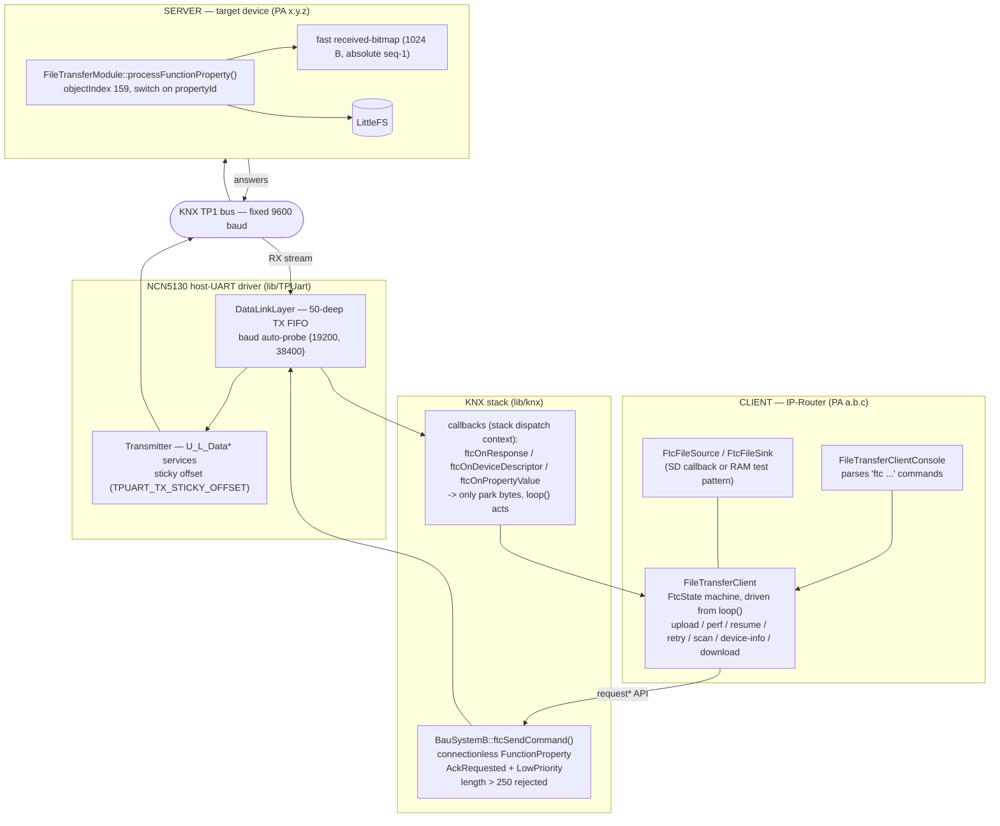
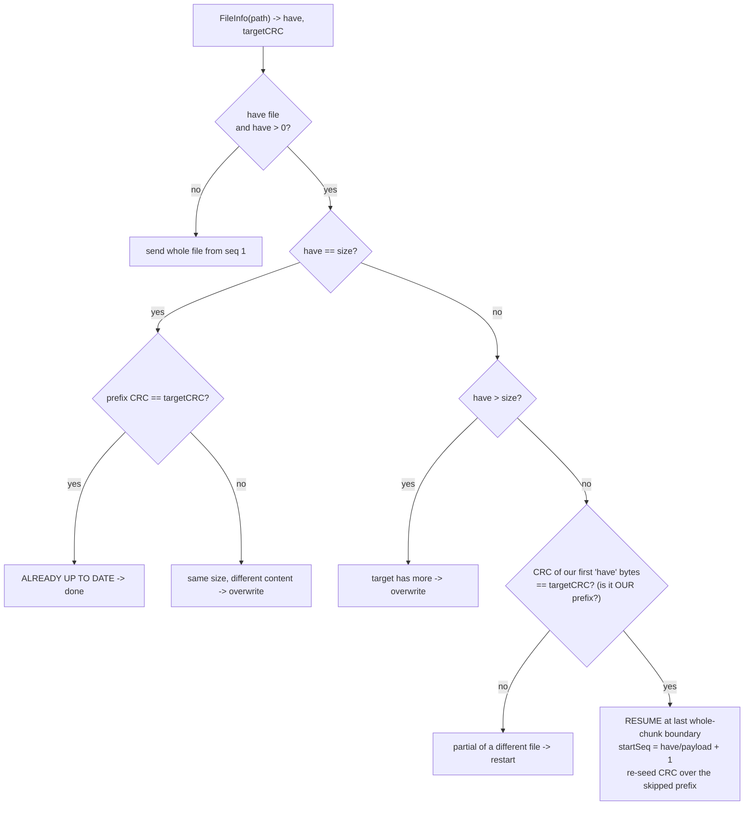

# FileTransferClient / FileTransferModule (FTC) — Engineering Reference

KNX file transfer over the bus, **PA → PA, with no PC in the chain**. One OpenKNX device
(the **client**) pushes or pulls a file to/from another device's **server**, driving a small
non-blocking state machine over the KNX application layer. This document is the definitive
description of the wire protocol, the transfer modes, resume/recovery/retry, the measured
throughput, and — most importantly — *why* it runs at the speed it does.

> Audience: a firmware engineer who has never seen this code. Everything below is cited against
> the real source (`file:line`); every measured number is from a real hardware run and is kept exact.

- **Client:** `src/FileTransferClient.{h,cpp}` (+ `FileTransferClientConsole.{h,cpp}` for the `ftc` console) — behind `-D OPENKNX_FTC`.
- **Server:** `src/FileTransferModule.{h,cpp}` — compiled on any RP2040/ESP32 target (writes to LittleFS).
- **Transport:** `lib/knx/src/knx/bau_systemB.cpp` (`ftcSendCommand` + response callbacks) and `lib/knx/src/knx/bau091A.cpp` (`ftcTxQueueSize`).
- **Wire driver:** `lib/TPUart/src/TPUart/{Transmitter,DataLinkLayer}.cpp` (NCN5130 host-UART).

---

## Table of contents

1. [Overview](#1-overview)
2. [Architecture](#2-architecture)
3. [Transfer modes](#3-transfer-modes)
4. [Wire protocol](#4-wire-protocol)
5. [Resume, recovery & auto-retry](#5-resume-recovery--auto-retry)
6. [Throughput & measurements](#6-throughput--measurements)
7. [The bottleneck (the key section)](#7-the-bottleneck)
8. [Optimizations & fixes](#8-optimizations--fixes)
9. [Metrics & reporting](#9-metrics--reporting)
10. [Build flags & configuration](#10-build-flags--configuration)
11. [Console usage](#11-console-usage)
12. [Known limits & future work](#12-known-limits--future-work)
13. [Glossary / abbreviations](#13-glossary--abbreviations)

---

## 1. Overview

FTC is two halves of the same OFM:

| Role | Class | Runs on | Responsibility |
|---|---|---|---|
| **Client** | `FileTransferClient` | the IP-Router (this device) | Drives the transfer: opens, streams chunks, reports progress, verifies, resumes, retries. Reads the source locally (SD via a callback, or a built-in RAM test pattern). |
| **Server** | `FileTransferModule` | the target (e.g. a KNeoPix) | Receives the frames, writes them to **its own** LittleFS, answers CRCs, gap reports and filesystem capacity. The client never touches the target's filesystem directly. |

The client speaks a **connectionless** dialect of the KNX *FunctionProperty* command
(`T_Data_Individual`, no connection is ever opened — see §2). Everything is driven from `loop()`;
**nothing blocks and nothing calls `delay()`**, because the router must keep routing bus traffic
and feeding its 16 s watchdog while a multi-minute upload is in flight.

The source is reached through a callback triple so the client needs no SD header
(`FileTransferClient.h`):

```c
struct FtcFileSource {                                    // upload source (read side)
    int32_t (*open)(const char *path);                    // returns file size, or -1 on failure
    uint8_t (*read)(uint32_t offset, uint8_t *buf, uint8_t len);
    void    (*close)();
};
struct FtcFileSink {                                      // download sink (write side)
    bool (*open)(const char *path);
    int  (*write)(const uint8_t *buf, uint16_t len);
    void (*close)();
};
```

On the IP-Router build there is **no SD card**, so only the RAM test pattern
(`ftc <pa> send test`, `ftc <pa> perf`) is used — which is exactly what the throughput A/B needs.

---

## 2. Architecture

### 2.1 Layer stack



Key transport facts (`bau_systemB.cpp`):

- **Connectionless.** No `isConnected()` gate — the reference clients (KnxFileTransferClient /
  Kaenx.Konnect) send plain `T_Data_Individual` and never open a KNX connection. Gating on a
  connection we never open would reject every frame. It also means FTC must **never** call
  `disconnect` — `_connectedTsap` is global stack state and could belong to someone else's ETS session.
- **`AckRequested`.** Every command (including the *silent* fast DATA frames) is sent AckRequested,
  so TP1 layer-2 keeps doing `L_ACK` / `BUSY` / retransmit — the only flow-control backstop left.
- **`LowPriority`, not `SystemPriority`.** A firmware upload is minutes of frames; at SystemPriority
  it would win every bus arbitration and starve time-critical group traffic (switching, alarms). Low
  lets FTC yield to everything else. The server echoes the request priority, so the answers are Low too.
- **Stack-overflow guard.** `ftcSendCommand()` rejects `length > 250` *before* the send
  (`bau_systemB.cpp`): `functionPropertyCommandRequest()` builds a stack-local `CemiFrame(3+length)`
  and `memcpy`s into a 263-byte buffer at APDU offset 13, so the payload must fit `263 − 13 = 250` bytes.
  `length` is caller-controlled (a fast DATA frame is `5 + n`), so it is bounded hard.

### 2.2 Dispatch-context rule

The three response callbacks (`ftcOnResponse`, `ftcOnDeviceDescriptor`, `ftcOnPropertyValue`) fire
**inside the KNX stack's own dispatch**. They do the absolute minimum — copy the bytes into a buffer
and set a `volatile` flag — and return. The state machine reads that flag in the next `loop()` tick
and does the file I/O and the follow-up send there. Doing I/O or a send from inside the callback would
re-enter the application layer from within its own callback. Scan answers use a small
single-producer/single-consumer ring (`_ftcDdQ[16]`) because two devices can answer back-to-back
between two `loop()` ticks and a single slot would drop one.

### 2.3 The `loop()` state machine

`FtcState` (`FileTransferClient.h`) has ~30 states. Grouped by job:

```
                         ┌──────────────────────────────────────────────────────────┐
                         │                        FtcIdle                            │
                         └───┬───────────┬──────────┬──────────┬─────────┬───────────┘
     ping ──────────────────┘           │          │          │         │
       FtcSent                          │          │          │         │
                                        │          │          │         │
     upload/perf (mode 1|2) ── FtcFeatureProbe ──┐  │          │         │
     upload/perf (all modes) ─────────── FtcResumeInfo (pre-upload FileInfo -> resume decision)
                                              │
                   ┌── mode 0 (classic) ──────┤────── mode 1|2 (fast/forget) ──┐
                   │                          │                                │
        FtcUploadOpen                         │                        FtcFastOpen
        FtcUploadChunk  <──┐                  │                        FtcFastStream  (pump, SILENT data)
        FtcUploadChunkRetry┘                  │                        FtcFastReport  (cmd45 gap bitmap)
        FtcUploadClose                        │                        FtcFastResend  (resend gaps)
                   │                          │                        FtcFastClose
                   └──────────────► FtcVerify (whole-file CRC32) ◄──────────────┘
                                        │
                            FtcPerfCleanup (perf only) ─► FtcIdle

   other jobs: FtcInfo · FtcFsInfo (df / ll footer / pre-upload space check) · FtcDelete (rm/mkdir/rmdir/mv/format)
               FtcDirList/FtcDirInfo (ll/ls) · FtcScan · FtcDevDescr/Ver/Feat/Prop/Enum/Load (device info)
               FtcDownloadOpen/Chunk · FtcCancel (drain + auto-retry re-entry point)
```

Every waiting state has the same shape: *if a response is pending, consume + validate + advance;
else if `millis() − _ftcSince > timeout`, time out.* `FTC_TIMEOUT = 6000 ms` for most states;
the fast path uses tighter, purpose-built deadlines (§3, §5).

---

## 3. Transfer modes

The upload command takes a **mode** (`ftc <pa> send <src> [pkg] [mode]`), 0/1/2:

| | **mode 0 — safe / classic** | **mode 1 — fast / windowed** | **mode 2 — forget** |
|---|---|---|---|
| Command | `FileUpload` (40) | `FileUploadFast` (44) | `FileUploadFast` (44) |
| Flow control | stop-and-wait: one request → one answer **per chunk** | AIMD window `[4..64]`, per-window gap report | one giant window (whole file), millis()-paced |
| Answer per DATA frame | yes (5-byte `[result][seq][crc16]`) | **none** (silent; L2 ACK only) | **none** (silent) |
| Mid-stream reports | — | `FileReport` (45) after each window | none — verify only at close |
| Integrity per frame | CRC16 echoed & compared | trailing CRC16 in the frame, checked on target | trailing CRC16 in the frame, checked on target |
| Payload/chunk | `pkg − 6` | `pkg − 8` (2 B reserved for in-frame CRC16) | `pkg − 8` |
| Pacing | implicit (waits for each answer) | TP-FIFO high/low water (`FTC_TX_HIGH=30`, `FTC_TX_LOW=1`) | `FTC_FORGET_BURST=4` / `FTC_FORGET_PACE_MS=25` + FIFO |
| Recovery | per-chunk retry (`_cfgMaxRetries`, default 3) | resend the window's missing seqs | escalate: report-recovery → classic full resend → abort |
| When to use | always correct; the safe default | reliable link, want fewer round trips | fastest over a **paced** path; best over TP; needs recovery net |
| Measured @19200 (50 KB) | **349 B/s** | **366 B/s** | **368 B/s** |

**Negotiation.** A non-zero mode is not blind. The client first sends `CheckFeatures` (102) with a
short **800 ms** window (`FTC_FEATURE_TIMEOUT`, *not* the 6 s `FTC_TIMEOUT`, so an old server that
never answers cmd102 falls back fast). It gates on:

- no answer (old server) → **downgrade to classic**;
- `FAST` bit (`0x04`) clear → **downgrade to classic**;
- file needs more chunks than `FTC_FAST_MAX_CHUNKS = 8192` → **downgrade to classic**.

A downgrade is logged once (`FileTransferClient.cpp`). A per-PA feature cache
(`_ftcFeatValid/_ftcFeatPa/_ftcFeatBits`) skips the re-probe for the rest of the session; only a *real*
answer is cached (a probe timeout is not — it may be transient and must not pin a device to classic).

Because a fast frame reserves 2 bytes for its in-frame CRC16, the *wire* frame is the same proven size
in all modes: classic `pkg−6` payload + 6 overhead, fast `pkg−8` payload + 6 + 2 CRC. If a fast request
is downgraded, the classic path just runs with 2 fewer payload bytes — still 100 % correct, marginally
less efficient (`FileTransferClient.cpp`).

---

## 4. Wire protocol

### 4.1 Command IDs (FunctionProperty `propertyId` on object index **159**)

Object index `159` is hard-required — the server rejects anything else (`FileTransferModule.cpp`).
The enum is sparse (`FileTransferModule.cpp`); an unknown id is silently ignored (the server only
answers `if (handled)`). Object index **160** is a *separate* interface used only by the optional console
tunnel (§11.1, `OPENKNX_FTC_CONSOLE`) — it does **not** extend this 159 command table.

| ID | Name | Direction | Answered? | Purpose |
|---:|---|---|---|---|
| 0 | `Format` | → | yes | `LittleFS.format()` — wipes **all** files + folders |
| 1 | `Exists` | → | yes | `LittleFS.exists(path)` |
| 2 | `Rename` | → | yes | `mv` (payload `old\0new\0`) |
| 40 | `FileUpload` | → | yes | classic upload: seq 0 = open, `0xFFFF` = close, else data |
| 41 | `FileDownload` | → | yes | pull a file: open then per-chunk |
| 42 | `FileDelete` | → | yes | `rm` |
| 43 | `FileInfo` | → | yes | size + CRC32 of a file |
| **44** | `FileUploadFast` | → | open/close **yes**, data **no** | fast upload (silent data) |
| **45** | `FileReport` | → | yes | received-bitmap gap query |
| 46 | `FilesystemInfo` | → | yes | LittleFS total + used bytes (`df`, the `ll` footer, the pre-upload space check) |
| 80 | `DirList` | → | yes | stateful iterator, one entry per round trip |
| 81 | `DirCreate` | → | yes | `mkdir` |
| 82 | `DirDelete` | → | yes | `rmdir` |
| 90 | `Cancel` | → | **no** | close the target's open file/dir (drain then finish) |
| 100 | `ModuleVersion` | → | yes | 6-byte major/minor/revision — also the `ping` |
| 101 | `FwUpdate` | → | no | RP2040 only: `picoOTA` + reboot |
| 102 | `CheckFeatures` | → | yes | 1 byte: bit0 Resume, bit1 Update, bit2 FAST |

Two more commands ride the KNX application layer directly (**not** object 159), used by scan and
device-info: `DeviceDescriptor_Read` (2-byte mask → device class) and `PropertyValue_Read`
(Device-Object identity properties). See `bau_systemB.cpp`.

### 4.2 Endianness — the one real trap

The protocol is **deliberately asymmetric** and getting it wrong looks exactly like a sequence
mismatch (`FileTransferClient.cpp`):

| Field | In the **request** | In the **answer** |
|---|---|---|
| chunk sequence | **little**-endian (`data[1]<<8 \| data[0]`) | **big**-endian (`pushWord`) |
| per-frame CRC16 | — | **big**-endian |
| fast DATA trailing CRC16 | **big**-endian (over `seq+len+payload`) | — |
| report `base` / `count` | **little**-endian | **big**-endian (echoed) |
| FileInfo `size` / `crc32` | — | **big**-endian |

### 4.3 Frame layouts (byte-by-byte)

**Classic upload — `FileUpload` (40)** (`FileTransferClient.cpp`, `FileTransferModule.cpp`)

```
OPEN   req : [00][00][payloadSize][flags][path... 00]      flags: 0=truncate("w"), 1=resume("r+"), >1 -> 0x42
       ans : [00]                                          1 byte; 0x00 ok, 0x42 open failed
DATA   req : [seqLo][seqHi][n][payload:n]                  seq little-endian, n = payload length
       ans : [result][seqHi][seqLo][crcHi][crcLo]          5 bytes; seq & CRC16 big-endian
CLOSE  req : [FF][FF]
       ans : (empty, resultLength = 0)                     arrival is the whole signal
```

**Fast upload — `FileUploadFast` (44)** (`FileTransferClient.cpp`, `FileTransferModule.cpp`)

```
OPEN   req : [00][00][payloadSize][flags][expLo][expHi][path... 00]
             flags bit0 = resume(r+), bit1 = keepBitmap (recovery re-open); expectedChunks little-endian
       ans : [00] ok  |  [42] open failed  |  [4A] too many chunks (> 8192 -> client goes classic)
DATA   req : [seqLo][seqHi][n][payload:n][crcHi][crcLo]    SILENT; trailing CRC16 (Modbus) big-endian over seq+len+payload
       ans : NONE                                          server returns false -> no L7 answer; L2 still ACKs
CLOSE  req : [FF][FF]
       ans : [00]                                          1 byte
```

The server sets the received bit for a seq **only after** the trailing CRC16 verifies *and* the
position-write succeeds — so "bit set" ⇔ "the correct bytes are on disk" (`FileTransferModule.cpp`).
A malformed/short frame, a CRC miss, or an out-of-range seq leaves the bit clear → a recoverable gap.

**Gap report — `FileReport` (45)** (`FileTransferModule.cpp`)

```
req : [baseLo][baseHi][cntLo][cntHi][nonce]                base/count little-endian
ans : [00][baseHi][baseLo][cntHi][cntLo][nonce][bitmap...] base/count big-endian echo; nonce echoed
      bitmap = ceil(count/8) bytes, bit i (LSB-first) = seq (base+i) received
```

`count` is clamped so the answer stays in one frame: `resultLength = 6 + ceil(count/8) ≤ 247`
⇒ **`count ≤ 1928`**. The nonce lets the client reject a stale/mirrored report.

**FileInfo — (43)** (`FileTransferModule.cpp`)

```
req : [path... 00]
ans : [00][sizeB3][sizeB2][sizeB1][sizeB0][crcB3][crcB2][crcB1][crcB0]   9 bytes, big-endian
    | [42]                                                               1 byte -> file not found
```

**FilesystemInfo — (46)** (`FileTransferModule.cpp`)

```
req : (no payload)
ans : [00][totalB3][totalB2][totalB1][totalB0][usedB3][usedB2][usedB1][usedB0]   9 bytes, big-endian
    | [1-byte error / no answer]   old server without the command -> client degrades gracefully (§5.4)
```

Read-only (`LittleFS.info()` on RP2040/RP2350, `totalBytes()/usedBytes()` on ESP32) — never touches an
open file/dir, safe any time. The client derives `free = total − used`.

**Download — `FileDownload` (41)** (`FileTransferClient.cpp`, `FileTransferModule.cpp`)

```
OPEN  req : [00][00][pkg][path... 00]        pkg = FTC_DL_PAYLOAD = 240
      ans : [00][sizeB3..sizeB0]             size big-endian (5 bytes on the wire)
CHUNK req : [seqLo][seqHi]                   seq little-endian
      ans : [00][seqHi][seqLo][readed][data:readed][crcHi][crcLo]   seq & CRC16 big-endian; readed<pkg = last chunk
```

**DirList — (80)**: `req [dir\0]` → `ans [00][type][name...]`, `type` 0 = no more, 1 = file, 2 = directory.
**ModuleVersion — (100)**: `ans [majHi][majLo][minHi][minLo][revHi][revLo]`.
**CheckFeatures — (102)**: `ans [flags]`, `0x01` Resume, `0x02` Update (RP2040), `0x04` FAST.

### 4.4 The two CRCs

| CRC | Parameters | Where | Purpose |
|---|---|---|---|
| **CRC-16/MODBUS** | init `0xFFFF`, reflected poly `0xA001` | every classic DATA answer, every fast DATA trailer, every download chunk | per-frame integrity (`FastCRC16::modbus`) |
| **CRC-32/POSIX** | poly `0x04C11DB7`, init 0, no reflect, **xorout `0xFFFFFFFF`** | `FileInfo` (43), the final verify | whole-file end-to-end proof (`FastCRC32::cksum`) |

The whole-file CRC is **POSIX `cksum`, not zlib** (`FileTransferClient.cpp`). The client folds
the source into `_ftcSrcCrc` as it sends (fold-once via a watermark so resends don't double-count) and
at the end compares `_ftcSrcCrc ^ 0xFFFFFFFF` against the target's `FileInfo` CRC. "Bytes arrived" is
not "the *right* bytes arrived" — the verify is the only honest proof.

### 4.5 Result codes (`errorcodes.txt` + server)

| Code | Meaning | | Code | Meaning |
|---|---|---|---|---|
| `0x00` | OK | | `0x47` | short write — **filesystem full** |
| `0x01` | `LittleFS.begin()` failed | | `0x4A` | fast: too many chunks → go classic |
| `0x02` | `LittleFS.format()` failed | | `0x81` | dir already open |
| `0x03` | LittleFS not initialized | | `0x82` | dir can't be opened |
| `0x04` | requested pkg > max resultLength | | `0x83` | dir not opened |
| `0x41` | file already open | | `0x84` | dir can't be deleted |
| `0x42` | file can't be opened | | `0x85` | dir can't be created |
| `0x43` | file not opened | | `0x86` | dir has no more files |
| `0x44` | file can't be deleted | | | |
| `0x45` | file can't be renamed | | | |
| `0x46` | seek failed | | | |

### 4.6 Server write core

Every write — classic *and* fast — goes through one position-write
(`FileTransferModule.cpp`):

```c
bool writeChunk(uint16_t sequence, const uint8_t *payload, uint8_t n) {
    if (!_file.seek((uint32_t)(sequence - 1) * _size)) return false;   // absolute offset
    return _file.write(payload, n) == n;
}
```

It seeks on **every** call (no continuity shortcut): the fast path writes out of order and a resend of
the same seq must land at its absolute offset. An in-order seek to the current position is a no-op in
LittleFS, so this is free on the classic stream. `_size` is the payload-per-chunk the client sent in
the open frame — the client's `pkg` accounting and the server's seek stride must agree, which is why
`payloadSize` is mirrored in the open.

### 4.7 What the ETS bus monitor shows during a transfer — "Ungültiger Frame" & phantom telegrams (harmless)

> **TL;DR for the non-expert:** watching an FTC transfer in the ETS *Busmonitor* you will see a flood of
> red **"Ungültiger Frame" / "Invalid frame"** and, now and then, a scary-looking **phantom** telegram
> (an `A_Memory_Write` or a `GroupValueWrite`) addressed to devices/GAs that **don't exist** in your
> project. **Nothing is being written anywhere — it is a sniffer display artifact. The transfer is fine.**

**Why it happens.** An FTC data chunk carries **240–250 payload bytes** (§4.3, §6.4). That does not fit a
*standard* KNX frame (max ~15-octet APDU), so every data frame is a **KNX extended L_Data frame**
(`octetCount > 15` ⇒ extended, `cemi_frame.cpp:410`) carrying the FTC payload on its **private object 159**.
For a passive sniffer like the ETS monitor, two things follow:

1. It **cannot decode** the long FTC payload (a private FunctionProperty on obj 159 with 240 B of file
   data) as any standard KNX service → it flags the frame **"Ungültiger Frame"**.
2. In **fast/forget** mode the data frames are **silent, back-to-back bursts** (§3 — no per-frame answer).
   A monitor that delimits the wire by *timing* can slip its frame boundary inside a burst and parse
   **mid-telegram**, reading file bytes as a frame header. Firmware (`.gz`) bytes are high-entropy, so once
   in a while they line up into a **valid-looking** standard telegram → the **phantom** Memory_Write /
   GroupValueWrite. Its source/dest/GA are *file data*, not real addresses.

**Proof it is benign** (from a real trace):

- The **real** frames are point-to-point `client ↔ target` (e.g. `5.0.0 ↔ 5.0.3`), sent **`AckRequested`**
  (§2.1), so TP1 layer-2 **`LL_ACK`s every one** — the ACK is visible in the monitor.
- The data frames are **exactly correlated** to the requests: a request `ObjectIndex=159 PropertyId=41
  Data=DB03` (pull seq `0xDB`) is answered by an "invalid" frame whose raw bytes contain
  `… 9F 29 00 03 DB F0 …` = obj `0x9F`(159), pid `0x29`(41), seq `DB`, then the data marker `F0` + payload.
  It is the requested chunk, not noise.
- The transfer ends with a **CRC32/POSIX verify OK** (§4.4). A genuinely malformed frame leaves the
  server's received-bit clear (§4.3) and the file fails to verify — which does not happen.
- Real KNX devices frame by **length + checksum**, not by timing, so they never misframe; and every FTC
  frame is individually addressed to the target's PA, so **no other device even processes it** (wrong
  individual address). The phantom PA/GA is never actually on the wire.

**Rule of thumb.** During an FTC transfer, **any monitor line with blank device names** (empty
*Quellname/Zielname*) and an unfamiliar address (`1.3.171`, `7.0.105`, `13/0/29`, …) is a **sniffer
misframe — ignore it**. The only *real* FTC traffic is the `client ↔ target, ObjectIndex=159` lines, each
with `LL_ACK`.

**Nothing to fix.** This is inherent to moving bulk data over KNX (big chunks ⇒ extended frames). No FTC
mode avoids it — even `safe` uses 247-byte chunks; shrinking to a ≤14-byte APDU would make every frame
ETS-decodable at ~15× the transfer time, which is pointless. FTC file transfer is the one tolerated
exception to "standard KNX services only" (§4.1), and this monitor cosmetics is a direct consequence.

---

## 5. Resume, recovery & auto-retry

Three independent safety nets, from finest to coarsest grain.

### 5.1 Resume (every upload starts here)

Every `send`/`resume`/`perf` runs a `FileInfo` **before** opening (state `FtcResumeInfo`,
`FileTransferClient.cpp`). Opening blindly with truncate would throw away a partial we could
have continued. The decision:



The prefix check matters: without it, a partial of a *different* file would transfer to completion and
only fail at the final verify — wasting the whole run and repeating on every retry. Resume continues at
the last **whole-chunk** boundary (`have / payloadSize`), never mid-chunk, so the seek stride stays exact.

### 5.2 Fast/forget recovery (never accept a silently-bad file)

The forget mode has no per-chunk answer, so a bad file can only be caught at the end. On a verify
mismatch it escalates (`FileTransferClient.cpp`):

1. **Report-based gap recovery.** Re-open with `resume + keepBitmap` (flags `0x03`) so the server keeps
   its received-bitmap, page the whole file with `FileReport` queries (`FTC_FAST_PAGE = 1024` seqs per
   report), resend only the still-missing seqs, re-verify. The whole file was already folded into the
   source CRC during the stream (fold-once), so resends don't corrupt the CRC (watermark pinned at
   `_ftcChunks`).
2. **One classic full resend.** If recovery still mismatches: truncate and resend the whole file over
   the classic stop-and-wait path (the most robust path there is), then re-verify.
3. **Clean reported abort.** If even that mismatches, abort with a clear message — never a silent bad file.

The windowed mode (mode 1) recovers inline: each `FileReport` names the missing seqs of the current
window; `FtcFastResend` re-sends exactly those, then re-reports the same window with a fresh nonce.

**AIMD window** (`FileTransferClient.cpp`): a clean window grows `+8` (up to
`FTC_WND_MAX=64`); any loss halves it (down to `FTC_WND_MIN=4`). The halving sizes the *next* window —
the current window's high edge is frozen (`_ftcWndEnd`) when it opens, so halving can never orphan
already-streamed tail seqs.

**No-progress guard** (`FTC_NOPROGRESS_MAX = 4`): the received-bitmap is monotonic, so the missing count
is non-increasing; if it fails to shrink across 4 reports the seqs are persistently dead → abort. This
replaced a fixed wall-clock deadline that false-aborted a slow-but-steady TP transfer (§8).

### 5.3 Transfer-level auto-retry

Most upload aborts are *transient* — the target briefly busy after a format's flash erase, a reboot,
a lost report or close. `ftcAbort()` (`FileTransferClient.cpp`) classifies the reason string:

- **Permanent** (fail immediately): contains `source` · `cannot read` · `refused` · `recovery failed` ·
  `no progress` · `too many` · `full` · `space` · `cancel`.
- **Transient** (everything else): if `_ftcUpload` and `_ftcTransferRetries < _cfgTransferRetries`,
  send `Cancel` (90) to close the target's partial, wait `_cfgBackoffMs` for a busy/rebooting target to
  settle, then **re-run the whole transfer** — which re-runs `FileInfo` and resumes from the partial
  already on the target.

Both bounds are **runtime-settable** (RAM-only, reset to the defaults on reboot) via
`ftc retry transfer <n>` / `ftc retry backoff <ms>` — see §11. Also `ftc retry max <n>` for the
**per-chunk** budget `_cfgMaxRetries` (§5.2). Defaults: `max 3`, `transfer 8`, `backoff 3000 ms`
(`FTC_MAX_RETRIES_DEF` / `FTC_TRANSFER_RETRIES_DEF` / `FTC_RETRY_BACKOFF_MS_DEF`). Setting `transfer 0`
disables the whole-transfer auto-retry.

The source is deliberately kept open across the retry (the retry re-enters `ftcStart`, not
`requestUpload`, and the resume path must re-read it; `read()` is stateless/offset-based, so a still-open
handle is safe). The retry budget resets only on a fresh `request*`, never inside `ftcStart`.

### 5.4 Pre-upload space check

Between the resume decision and the actual open, `ftcProceedToUpload()` runs a **one-time**
`FilesystemInfo` (46) query (state `FtcFsInfo`, purpose 1) to make sure the file will fit *before*
streaming a whole transfer that can only fail at `0x47` (fs full) near the end
(`FileTransferClient.cpp`, `2415-2433`). The check runs once per transfer and survives a retry
(`_ftcSpaceChecked`). The arithmetic:

```
need   = _ftcSize − _ftcResumeBase            # bytes still to write this run
credit = (_ftcResumeBase == 0) ? _ftcTargetHave : 0   # a truncate open("w") frees the old file; resume keeps its partial
avail  = free + credit                        # free = total − used, from the server answer
abort "not enough space on target filesystem"  IF  need + FTC_FS_MARGIN (8192) > avail
```

`_ftcTargetHave` is the existing target file's size, learned in `FtcResumeInfo`. The `8192`-byte margin
covers LittleFS block rounding + metadata. The abort reason contains `"space"`, which is in the
**permanent** set (§5.3, `ftcAbort` `strstr(reason,"space")`) — no auto-retry, because a retry cannot
create room.

**Graceful degrade / backward-compat.** An old server without command 46 answers a 1-byte error or
times out. In that case the check is skipped and **the upload proceeds anyway** (logged as
"uploading without the space check") — so it is safe against a KNeoPix running the old server. The same
degrade makes `df` and the `ll` footer silently omit the bar.

---

## 6. Throughput & measurements

All numbers below are **measured on real hardware** this session — target **KNeoPix at PA 5.0.3**,
a 50 KB `/ftcperf.bin` ramp, verified `CRC32/POSIX = 0x6F8129C7`.

### 6.1 Sustained TP throughput (over the 9600-baud KNX TP1 bus)

| Mode | File | Host baud | Throughput | Notes |
|---|---|---:|---:|---|
| classic (mode 0, stop-and-wait, per-chunk answer) | 50 KB | 19200 | **349 B/s** | 146.4 s, payload 247, 208 chunks |
| fast (mode 1, AIMD 8..64 + cmd45 gap reports) | 50 KB | 19200 | **366 B/s** | 139.8 s, payload 245, 209 chunks |
| forget (mode 2, one window, paced, no mid-stream reports) | 50 KB | 19200 | **368 B/s** | 139.1 s |
| forget | 50 KB | **38400** | **478 B/s** | 107.0 s — **+30 %**, a 38400-strapped board |

The three modes land within ~5 % of each other at 19200 because **the wire, not the protocol, is the
limit** (§7). The jump to 478 B/s comes purely from doubling the *sender's* host-UART baud.

### 6.2 Numbers that will fool you (read this before quoting a speed)

- **forget 16 KB "@26 KB/s" was the IP path, not TP.** That run went over KNXnet/IP routing
  (~75× faster than TP), not the TP1 bus. It is not a TP measurement.
- **fast 4 KB "@981 B/s" was a TX-FIFO-fill artifact.** The whole 4 KB file fit inside the 50-deep TP
  transmit FIFO, so the client "finished" queuing before the wire had drained. Any file smaller than the
  FIFO reports a burst rate, not a sustained one.
- **The progress line's early "avg" is inflated.** `_ftcDone` counts bytes *queued into the FIFO*, not
  bytes *drained onto the wire*. The first ~50 frames leave at IP/FIFO speed, so the cumulative average
  starts high and "falls and falls" as the wire settles — even while the wire is perfectly steady.
  **Trust the interval rate and the end-to-end number**, not the early average (§9).

### 6.3 Per-frame timing model (derived; fits the data)

```
T_frame  ≈  2.45 ms/octet × (payload + ~9 header octets)  +  ~66 ms fixed per-frame overhead
```

The ~66 ms fixed cost is `L_ACK` + inter-frame gap + CSMA arbitration. The `2.45 ms/octet` is *not*
the bare 9600-baud TP octet time — it already bakes in the store-and-forward doubling (§7): host time
adds in series with bus time, so each octet costs roughly one TP octet *plus* two host-UART bytes.

| Host baud | Time/frame @ payload 245 | Throughput | |
|---|---:|---:|---|
| 19200 | ~666 ms | **~368 B/s** | matches the measured 368 |
| 38400 | ~520 ms | **~478 B/s** | matches the measured 478 |

Asymptotic per-octet ceiling ≈ **408 B/s @19200** (frame → ∞, the fixed 66 ms amortized away).

### 6.4 The `pkg` sweet-spot = **253**

Throughput is **monotonic in frame size** — a bigger frame amortizes the fixed per-frame overhead over
more payload, so it is *always* faster; going smaller only loses. `pkg 253` (the KNX extended-frame max)
reaches **~90 % of the per-octet ceiling**.

- Why 253 and not 254: at 254 the NPDU length overflows `uint8` (`256 → 0`), `valid()` drops the frame
  with a bare "invalid frame". Measured: 253 ok, 254 aborts (`FileTransferClient.cpp`).
- The frame passed to `ftcSendCommand` at `pkg 253` is exactly **250 bytes** (fast: `245 payload + 5`;
  classic: `247 payload + 3`) — precisely the stack-overflow guard's ceiling (§2.1). The two limits are
  independent but happen to meet at 253.

**Rule of thumb:** use `pkg 253` for every real transfer. Only drop `pkg` if a device on the path
advertises a smaller max-APDU.

---

## 7. The bottleneck

> This is the crown jewel — why 9600-baud TP delivers only ~350–480 B/s, and where the real limit is.

### 7.1 TP1 is fixed 9600 baud — by the standard, not a setting

KNX TP1 is **fixed at 9600 baud** by the KNX standard (EN 50090 / ISO 14543-3). It is not a chip
register you can raise. After 11-bit characters, the layer-2 `L_ACK`, inter-frame gaps, and CSMA/CA
arbitration, the usable payload rate on a healthy line is roughly **350–870 B/s** depending on frame
size. That is the hard ceiling for *any* device on the wire.

### 7.2 The real limiter is the host-UART, not the TP wire

FTC measures **349–368 B/s @19200**, well under even the low end of that TP range. The limiter is the
**NCN5130 host link** — the UART between the MCU and the NCN transceiver, strapped to **19200 baud** —
for two compounding reasons:

**(a) Store-and-forward.** The NCN transmits a frame onto TP *only after the whole frame has arrived
over the host UART* (datasheet p.49). So the host-transfer time adds **in series** with the bus time —
it does not hide behind it.

**(b) Two host bytes per KNX octet.** For every octet the host sends the NCN a `U_L_Data*` command/
position byte **and** the data byte (`Transmitter.cpp`). A 253-octet frame is therefore
~**509 host bytes** (after the sticky-offset optimization, §7.4) ≈ **292 ms @19200** — roughly *equal
to the TP time of the same frame*. Add the two in series and **per-frame time ≈ doubles**. That doubling
is exactly the `2.45 ms/octet` in the model (§6.3).

```
                 host UART (19200)            TP1 bus (9600)
   frame ready ─► [==== ~292 ms ====]──────► [==== ~292 ms ====] ─► L_ACK + gap (~66 ms)
                  (store-and-forward: the two run IN SERIES, not overlapped)
                  └───────────────── ~666 ms/frame @ pkg 253 ──────────────┘
```

### 7.3 Send ≠ Receive — the asymmetry that decides which baud matters

The two directions are **not** symmetric:

| | **Transmit (host → NCN → TP)** | **Receive (TP → NCN → host)** |
|---|---|---|
| Frame handling | **store-and-forward** (whole frame buffered first) | **streamed** (each byte forwarded as it arrives off TP) |
| Host bytes/octet | **2** (command + data) | ~**1** (data) |
| Host time vs bus time | **in series** — exposed | **in parallel** — hidden behind the slower bus |

On receive, the NCN forwards each byte the moment it arrives off the slow TP wire, ~1 byte per octet,
and 19200 is comfortably faster than the 9600 TP arrival rate — so the host time runs *underneath* the
bus time and never shows. **Only the sender's host baud matters.** A 19200 receiver is never the
bottleneck.

That is precisely why **a 38400-strapped sender talking to a 19200 receiver measured 478 B/s** (§6.1):
the send side halved its exposed host time; the receive side was never the limit.

### 7.4 Host baud is a hardware strap — nothing to change in firmware

The NCN5130 host-UART baud is sampled **at reset from a pin strap** (datasheet p.27, pin **CSB/UC1**,
pin 26): `0 = 19200`, `1 = 38400`. **No runtime command or register changes it**, and 38400 is the
chip's max UART baud. The firmware already **auto-probes `{19200, 38400}`** at init and uses whatever
the board is strapped to (`DataLinkLayer.cpp`):

```c
uint baudrates[2] = {19200, 38400};
for (uint baudrate : baudrates) { ... if (tryInitialize(baudrate)) { setBCUState(BCU_CONNECTED, baudrate); ... } }
```

So there is **nothing to change in firmware** to go faster. Making a board faster = strap CSB/UC1 high
(a PCB rework). The measured +30 % from 19200 → 38400 is the whole available win from the host UART.

### 7.5 The only way past the UART: SPI @ 500 kbps

The one higher-bandwidth host link the NCN5130 offers is **SPI at 500 kbps** — enabled by the MODE2
strap plus SCK/CSB/TREQ wiring and a new SPI host driver. It would nearly eliminate the store-and-forward
serial latency and push toward the **~800 B/s TP-bus limit** itself. It is a substantial hardware +
firmware project (new strap, new wiring, a new driver), not a config change — see §12.

### 7.6 Sticky-offset: the extractable software win (already shipped)

At a given baud, the one thing firmware *can* do is stop re-sending the `U_L_DataOffset` byte on every
octet. The NCN "stores [the offset] internally until a new offset is provided" (datasheet p.42), so it
only needs to be sent when the 6-bit position offset **changes** — 3 times per 253-octet frame instead
of ~189 (`Transmitter.cpp`, flag `TPUART_TX_STICKY_OFFSET`):

```
253-octet frame, host bytes:  without sticky ≈ 698   →   with sticky ≈ 509   (saves ~189)
measured at pkg 253: +14 %   (at pkg 64 only ~7 bytes saved -> +3 %; it scales with frame length)
```

Because the whole host transfer is store-and-forward, those ~189 bytes are paid in full, in series with
the bus — so removing them is a real, measurable speed-up. **Below 2 host bytes per octet is impossible**
in the TPUART command protocol; sticky-offset is the floor at a given baud.

### 7.7 Theoretical throughput limits (hardware)

First-principles math any reader can reproduce — it decomposes §6.3's blended `2.45 ms/octet` into its
host and bus parts, then extrapolates to the hardware ceilings.

```
   MCU ──[ host link: UART 19.2/38.4 kbps  or  SPI 500 kbps ]──► NCN5130
                                                                    │
                                    whole frame buffered, THEN ─────┘
                                                                    ▼
                                              KNX TP1 bus  (fixed 9600 baud)
```

**store-and-forward (datasheet p.49):** the bus transmission starts only after the *full* frame has
arrived over the host link, so host time and bus time are **sequential, not overlapped**.

**Derivation** (per 253-octet extended frame, 245 B payload):

- **Bus (immovable).** TP1 is fixed at 9600 baud. Each octet on the wire ≈ **1.35 ms** (~13 bit-times:
  start + 8 data + parity + stop + inter-octet spacing) → bus ≈ `253 × 1.35` ≈ **342 ms/frame**.
- **Host link.** The TPUART protocol sends **2 host bytes per KNX octet** (a command/position byte + the
  data byte) → ~**506 host bytes/frame**. UART is 8E1 = **11 bits/byte**; SPI is **8 bits/byte** (no
  parity/framing). `host_time = host_bytes × bits_per_byte / baud`.
- **Per-frame.** `frame = host_time + bus (342 ms) + overhead (~34 ms: L_ACK + inter-frame gap +
  L_Data.con)`. `throughput = 245 B / frame`.

**Validate against the two measured points** (the model reproduces both, which proves it):

- UART **19200**: host = `506×11/19200` ≈ 290 ms → frame ≈ `290+342+34` ≈ 666 ms → ≈ **368 B/s** (measured 368 ✓)
- UART **38400**: host ≈ 145 ms → frame ≈ 521 ms → ≈ **478 B/s** (measured 478 ✓)

**Extrapolate (theoretical):**

- **SPI @ 500 kbps**: host = `506×8/500000` ≈ 8 ms (~16 ms with per-byte TREQ handshaking) → frame ≈
  `16+342+34` ≈ 392 ms → ≈ **625 B/s** — the practical maximum on this chip.
- **Bus-only ceiling** (host → 0): frame → ~376 ms → ≈ **650 B/s** — the hard wall set by the 9600-baud
  TP1 bus; no host-side change can beat it.

| Interface | host/frame | + bus (fixed) | + ovh | = frame | ≈ B/s | note |
|---|---:|---:|---:|---:|---:|---|
| UART 19200 | ~290 ms | 342 ms | 34 ms | ~666 ms | **~368** | measured ✓ |
| UART 38400 | ~145 ms | 342 ms | 34 ms | ~521 ms | **~478** | strap → +30 %, measured ✓ |
| SPI 500 kbps | ~16 ms | 342 ms | 34 ms | ~392 ms | **~625** | practical max; needs a new interface + driver |
| bus-only ceiling | ~0 ms | 342 ms | 34 ms | ~376 ms | **~650** | hard TP1 wall — unbeatable host-side |

The firmware levers are already applied — sticky-offset (§7.6) and the ESP32 `TPUART_TX_FAST` fast
forward path (`DataLinkLayer.cpp`). Everything beyond ~478 B/s is **hardware**: the 38400 strap
(§7.4) or the SPI link (§7.5, §12). **For real KB/s, use KNXnet/IP, not TP.**

---

## 8. Optimizations & fixes

Each entry: **what** · **why** · **impact**.

| # | Fix | Why | Impact |
|---|---|---|---|
| 1 | **FS partition sector-alignment** (`LittleFS block_size = 4096`, aligned in `lib/OFM-UsbExchange/platformio.exchange.ini`) | A non-4096-aligned filesystem partition corrupted every write that crossed a block boundary. | Root cause of a long-hunted corruption bug: **every multi-block file ≥ 8 KB** was corrupted. The write path itself (`writeChunk`) was never the culprit (`FileTransferModule.cpp`). |
| 2 | **TP transmit-queue print-storm reboot fix** (`KNX_FIXES_EC`, `tpuart_data_link_layer.cpp`) | Under an IP→TP routing flood (a forget upload = ~370 frames/s vs a 9600-baud wire), the TX FIFO stays full and a **per-dropped-frame USB-CDC print** stalls `loop()` past the 16 s watchdog → reboot. | Rate-limited the "queue full" log to ~1-in-1024 drops. A real problem is still visible; the self-DoS reboot is gone. |
| 3 | **Forget pacing** (`FTC_FORGET_BURST = 4`, `FTC_FORGET_PACE_MS = 25`) | Forget has no per-chunk report and, over IP, no TP-FIFO backpressure — it would blast ~94 KB/s, far past the target's RX socket + flash, dropping most chunks (16 KB → only ~6/67 landed). | A small burst that fits the target's ~2 KB RX socket, spaced by a `millis()` gate (~160 chunks/s ≈ 39 KB/s over IP; TP is slower still and FIFO-gated). |
| 4 | **Forget-recovery hardening** (`FileTransferClient.cpp`, `1847-1867`) | The report-retry counter reset only on a *whole-window advance*, which forget (one big page) never hits mid-recovery → scattered timeouts summed to a false abort. And an un-paced resend re-blasted the gaps and re-dropped them. | Retry counter now resets on **any** valid matching report (consecutive-not-cumulative); the resend is paced exactly like the initial stream. |
| 5 | **Progress-based deadline** (`FTC_FAST_STALL_MS = 30000`) | The old fixed "60 s + 100 ms/chunk" wall clock assumed a fast link and **false-aborted a slow-but-steady TP upload** mid-transfer. | The overall guard now aborts only if **no chunk makes forward progress** for 30 s (re-armed on every advancing chunk). A legitimately slow transfer is never killed. |
| 6 | **Transfer-level auto-retry** (`_cfgTransferRetries` default 8, `_cfgBackoffMs` default 3000 ms — runtime-settable via `ftc retry`) | A transient failure (target busy after a format erase / reboot, a lost report/close) should recover, not fail. | Bounded, **transient-only** (reason-string classification), **resume-based** re-run; the source is kept open across the retry. Permanent reasons fail immediately (§5.3). |
| 7 | **Interval-rate display** (`FTC_RATE_MIN_MS = 3000`) | Two deciles caught inside one FIFO-queuing burst give a near-zero `dt` → a nonsense spike (65k, 116k B/s). | Only an interval that spans ≥ 3 s (the FIFO has had time to drain, so queue-rate == wire-rate) is trusted; a shorter gap falls back to the cumulative average (`FileTransferClient.cpp`). |
| 8 | **Pure "data only" throughput** (`_ftcData100Ms`) | The user asked for the *reine Übertragungszeit* — transfer time, not finalization. | The clock stops when the **last payload byte left the wire** (the close is sent only after the FIFO drains below `FTC_TX_LOW`), **excluding** the close-ack round-trip and the whole-file CRC verify (those vary 10–1000 ms). |
| 9 | **`pkg` display fix** (`FileTransferClient.cpp`) | Fast/forget reserve 2 payload bytes for the in-frame CRC16, so the naive `payload + overhead` read 251, not the true on-wire 253. | The summary adds the 2 CRC bytes back so it reports the real `pkg 253`. |
| 10 | **BAU stack-overflow guard** (`bau_systemB.cpp`) | `ftcSendCommand` length is caller-controlled; `> 250` overflows the stack-local `CemiFrame` buffer. | `length > 250` is rejected before the `memcpy`. See §2.1. |
| 11 | **Sticky-offset** (`TPUART_TX_STICKY_OFFSET`) | Re-sending the offset byte per octet wastes ~189 host bytes/frame, paid in series with the bus. | **+14 % at pkg 253.** See §7.6. |
| 12 | **IP-mirror duplicate filtering** (`FTC_DUP_WINDOW_MS = 12`, sequence check, report nonce) | A second KNX-IP router on the line mirrors TP → IP routing multicast, so **every answer arrives twice** (a 621 KB run logged 3785 stale answers). A naive read desyncs the `ll` iterator or aborts at chunk 1. | Duplicates are dropped by time window + propertyId + sequence/nonce and merely counted; a 1-byte `0x00` (the open's echoed answer) is never mistaken for a rejection (`FileTransferClient.cpp`). |
| 13 | **Cooperative console output** (`ftcOut` / `ftcDrainOut`) | The multi-line `ll`/`df` blocks (header + rows + footer + usage bars) were all logged in one `loop()` pass; each `log()` blocks on USB-CDC, so the burst overran the loop-time budget → a "loop took longer" warning on every `ll`/`df`. | Output is queued and drained **one line per `loop()` pass**, gated on `openknx.freeLoopTime()`; the state machine waits while it drains, so order is preserved and no single pass trips the warning. |

---

## 9. Metrics & reporting

### 9.1 The summary box (one framed block, printed once at the end)

`ftcPrintSummary()` (`FileTransferClient.cpp`) prints, prefix-less and framed:

```
------------------------------------------------------------------------------
 Speed test: /ftcperf.bin
------------------------------------------------------------------------------
  Throughput   368 B/s   (51200 B in 139.100 s, data only)
  Chunks       209 x 245 B payload   (pkg 253)
  Verify       OK   size 51200   crc32 0x6F8129C7
  Cleanup      test file removed
------------------------------------------------------------------------------
```

| Field | Meaning |
|---|---|
| `Throughput ... data only` | end-to-end bytes ÷ **pure** time (grand-start → close sent). Excludes close-ack + CRC verify. |
| `With retry` *(only if retries)* | shows `data+recovery` wall time, retry count, and the recovery time subtracted for the transfer-only rate. |
| `Chunks` | `count × payload (pkg)` — the `+2` CRC bytes are added back so `pkg` reads the true on-wire size. |
| `Resumed` *(if any)* | bytes already on the target at the first open. |
| `Duplicates` *(if any)* | IP-mirror answers discarded. |
| `Verify` | `OK`/`FAILED`, size, and CRC32 — the ultimate gate. |
| `Cleanup` *(perf only)* | whether `/ftcperf.bin` was deleted from the target. |

### 9.2 Three different rates — don't confuse them

| Rate | Formula | When it is honest |
|---|---|---|
| **cumulative avg** | `sent / (now − start)` | over IP it *is* the true rate; over TP it is **inflated** early by the initial FIFO burst |
| **interval (instantaneous)** | `Δbytes / Δt` since the last decile, guarded by `FTC_RATE_MIN_MS` | the true *current* wire rate once the FIFO has drained |
| **end-to-end "data only"** | `eeSent / pureMs` | the headline number; survives auto-retries via the grand-start clock |

### 9.3 Retry timing

`_ftcGrandStartMs` / `_ftcGrandResumeBase` are set once at the first open and survive every auto-retry,
so the end-to-end figures are correct across retries. `_ftcRetryLostMs` accumulates the dead windows
(failed-attempt dead time + Cancel drain + backoff); the *transfer-only* rate subtracts it so it
reflects the wire, not recovery (`FileTransferClient.cpp`).

### 9.4 Live status for a UI

`status()` returns an `FtcStatus` (`FileTransferClient.h`) with `phase`, `target`, `done/total`,
`bps`, `chunk/chunks`, `ok`, `crc`, `path`, and a short `message` — plus `percentX100()`. Any front-end
(the console `ftc status`, WebConfig, the display/DDC) polls it; `phase == Done|Failed` marks the end.

---

## 10. Build flags & configuration

### 10.1 Compile-time flags (`platformio.custom.ini`)

| Flag | Where set | Effect |
|---|---|---|
| **`OPENKNX_FTC`** | per env (`:166`, `:260`, `:287`) | Enables the whole **client** (`FileTransferClient*`, the `ftc` console) **and** the send/receive FunctionProperty half in `lib/knx`. Everything it touches is behind this flag, so `grep -r OPENKNX_FTC` finds the full footprint. A server-only device (e.g. a NeoPixel) compiles the client to nothing. |
| **`OPENKNX_FTC_CONSOLE`** | per env, **initially undefined** (opt-in) | Enables the **interactive console tunnel** (`ftc <pa> console`, §11.1): the `con*` handlers on both sides, a console line-sink in `Console`, and — on the server — implies `OPENKNX_WEBCONSOLE` (the log ring, +`OPENKNX_WEBCONSOLE_BUFSIZE` = 4096 B RAM). All of it is behind this flag; removing `-D` falls back binary-identical. Grants full remote console access — enable only where wanted. |
| **`TPUART_TX_STICKY_OFFSET`** | `ec_flags_*` (`:37`, `:50`) | Send `U_L_DataOffset` only on change (§7.6). **+14 % at pkg 253.** Platform-agnostic. |
| **`KNX_FIXES_EC`** | `ec_flags_*` (`:39`, `:51`) | KNX robustness fixes, incl. the **print-storm rate-limit** (fix #2) and a null-deref guard on `PID_SUB_LCCONFIG` (`bau091A.cpp`). |

The **server** (`FileTransferModule`) is guarded by `#if defined(ARDUINO_ARCH_RP2040) || defined(ARDUINO_ARCH_ESP32)` — it compiles on any such target regardless of `OPENKNX_FTC`. `FwUpdate` (101): RP2040/RP2350 apply a gzipped image via `picoOTA`; ESP32 self-applies a RAW `.bin` (no gzip) via `Update`/OTA.

### 10.2 Client tunables (`FileTransferClient.cpp`)

| Constant | Value | Meaning |
|---|---:|---|
| `FTC_OBJECT_INDEX` | 159 | FunctionProperty object index (server-enforced) |
| `FTC_PKG_DEFAULT` / `MIN` / `MAX` | 64 / 16 / 253 | frame size bounds; 254 overflows the NPDU length |
| `FTC_PKG_OVERHEAD` | 6 | classic payload = `pkg − 6` (fast = `pkg − 8`) |
| `FTC_TIMEOUT` | 6000 ms | default per-state answer timeout |
| `_cfgMaxRetries` (`FTC_MAX_RETRIES_DEF`) | 3 | per-chunk retries (CRC/timeout) — **runtime** member, `ftc retry max <0..20>` |
| `_cfgTransferRetries` (`FTC_TRANSFER_RETRIES_DEF`) | 8 | whole-transfer auto-retries — **runtime** member, `ftc retry transfer <0..50>` (0 = off) |
| `_cfgBackoffMs` (`FTC_RETRY_BACKOFF_MS_DEF`) | 3000 ms | settle time before a transfer retry — **runtime** member, `ftc retry backoff <0..60000>` |
| `FTC_FEAT_FAST` | 0x04 | CheckFeatures FAST bit |
| `FTC_FEATURE_TIMEOUT` | 800 ms | short FAST-probe window |
| `FTC_FAST_MAX_CHUNKS` | 8192 | fast chunk cap (mirrors the server bitmap) |
| `FTC_WND_INIT / MIN / MAX` | 8 / 4 / 64 | AIMD window bounds |
| `FTC_TX_HIGH / LOW` | 30 / 1 | TP-FIFO water marks (of the 50-deep queue) |
| `FTC_FAST_BURST_SD / RAM` | 4 / 16 | per-`loop()` send cap (SD read is costly, RAM is cheap) |
| `FTC_RATE_MIN_MS` | 3000 ms | interval-rate dt guard |
| `FTC_FORGET_BURST / PACE_MS` | 4 / 25 | forget pacing |
| `FTC_REPORT_TIMEOUT / RETRIES` | 4000 ms / 3 | report-query answer timeout & retries |
| `FTC_NOPROGRESS_MAX` | 4 | reports without shrinking → abort |
| `FTC_FAST_PAGE` | 1024 | seqs per report during forget recovery |
| `FTC_FAST_STALL_MS` | 30000 ms | progress-based overall deadline |
| `FTC_DUP_WINDOW_MS` | 12 | IP-mirror duplicate window |
| `FTC_SCAN_SPACING_MS / DRAIN_MS / MAX_LIST` | 40 / 2500 / 128 | scan pacing, drain, listing cap |
| `FTC_DL_PAYLOAD` | 240 | download data bytes/chunk |
| `FTC_FS_MARGIN` | 8192 | free-space headroom demanded above `need` in the pre-upload space check (§5.4) — LittleFS block rounding + metadata |

The three retry bounds were compile-time `constexpr` until recently; they are now **runtime** members
(`_cfg*`) seeded from the `*_DEF` header constants, tunable live with `ftc retry` (§11) and RAM-only
(they reset to the defaults on reboot). The old `FTC_MAX_RETRIES` / `FTC_TRANSFER_RETRIES` /
`FTC_RETRY_BACKOFF_MS` constants are gone.

Server side: `FTM_FAST_MAX_CHUNKS = 8192` (→ 1024-byte bitmap, ~2 MB @ pkg 253); `HEARTBEAT_INTERVAL =
30000 ms` (auto-close an idle open file/dir — the fast handler self-refreshes it on every frame,
`FileTransferModule.cpp`); TP TX FIFO depth `MAX_QUEUE_SIZE = 50` (`Transmitter.cpp`).

---

## 11. Console usage

`ftc` is the console front-end (`FileTransferClientConsole.cpp`). The PA comes **first** because the
target changes less often than the command.

**Per-target — `ftc <pa> <cmd>`:**

| Command | Description |
|---|---|
| `ping` | is the target there? (module-version round trip) |
| `df` | target filesystem: framed Total / Used(%) / Free block + a 40-cell ASCII usage bar |
| `ll [dir]` | list a directory: name, size, CRC32 (detailed lists also append the `df` usage bar) |
| `ls [dir]` | list a directory: names only (no bar) |
| `info` / `i` | device fingerprint: mask/class, FTM version, features (+ identity, app/table load states) |
| `info ga` | group communication: resolved GA list + com-object (KO) links, read ETS-style over a T_Connect. **Not supported on BCU1 (mask 0x0012)** — BCU1 has no property/interface-object layer, so the table locations cannot be discovered (BCU1 uses a fixed, mask-specific memory map instead). Works on BCU2, System B and BIM M112. |
| `info <file>` | size + CRC32 of one file |
| `rm <file>` | delete a file |
| `format yes` | erase the **whole** filesystem (gated by `yes`) |
| `mkdir <dir>` / `rmdir <dir>` | create / remove a directory |
| `mv <old> <new>` | rename / move |
| `get <remote> [local]` | download a file from the target onto SD |
| `send <src> [pkg] [mode]` | upload — auto-resumes a matching partial |
| `resume <src> [pkg] [mode]` | upload — same, explicit resume |
| `perf [kb] [pkg] [mode]` | speed test: push a RAM pattern, report B/s, then delete it |
| `console` / `con` | **interactive console tunnel** into the target's OpenKNX console (§11.1) — needs `OPENKNX_FTC_CONSOLE` on both devices |

**Global — `ftc <cmd>`:**

| Command | Description |
|---|---|
| `scan [a.l \| a.l.d \| from to] [deep [N]]` | find devices via `DeviceDescriptor_Read`; `deep` = multi-pass union (robust over IP) |
| `scan full yes` | sweep the whole bus (65535 addresses — gated) |
| `scan area <a> yes i really know what i am doing` | sweep one area (gated twice) |
| `cancel` / `c` | stop the running transfer / scan |
| `status` / `s` | progress %, throughput, last result |
| `retry [max\|transfer\|backoff] [value]` | show/set the retry tuning at runtime (RAM-only) — see below |
| `ftc ?` / `ftc help` | full colored usage |

**Arguments:**

- `<pa>` — `a.l.d`, e.g. `5.0.3` (comes first).
- `<src>` — `test` = built-in 2 KB RAM pattern (→ written to `/ftctest.bin` on the target), or a local SD path.
- `[pkg]` — 16..253, default 64. **Bigger = faster; 253 = max** (§6.4).
- `[mode]` — `safe` | `fast` | `forget` (aliases: `win`/`windowed` = fast, `ff`/`faf` = forget). Order-tolerant with `pkg`.

**Examples:**

```
ftc 5.0.3 ping
ftc 5.0.3 df                    # target LittleFS: total / used(%) / free + usage bar
ftc 5.0.3 ll
ftc scan 5.0                    # sweep line 5.0
ftc scan 5.0.1 5.0.50 deep 5    # range, 5-pass union
ftc 5.0.3 perf 50 253 forget    # 50 KB test, pkg 253, forget mode
ftc 5.0.3 send /fw_neo.bin.gz 253 fast
ftc 5.0.3 info                  # device fingerprint
ftc cancel
```

The `df` block (`ftcPrintFsBar`, also appended to a detailed `ll`):

```
------------------------------------------------------------------------------
 Filesystem (LittleFS)
------------------------------------------------------------------------------
  Total      524288 B   (512 KB)
  Used       196608 B   (37%)
  Free       327680 B   (320 KB)
  [###############........................] 37%
------------------------------------------------------------------------------
```

**Runtime retry tuning — `ftc retry`** (`ftcRetryCmd`, `FileTransferClient.cpp`). `ftc retry`
(no arg, or `ftc retry ?`) lists all three settings with their current value and `[default]`;
`ftc retry <name>` prints one; `ftc retry <name> <value>` sets it. Values are **RAM-only** and reset to
the defaults on reboot — a fast knob for tuning/tests, not persisted config.

| Setting | Default | Range | Effect |
|---|---:|---|---|
| `max` | 3 | 0..20 | per-chunk retries on CRC/timeout before that chunk fails (§5.2) |
| `transfer` | 8 | 0..50 | whole-transfer auto-retries (transient abort → resume); **0 = off** (§5.3) |
| `backoff` | 3000 | 0..60000 ms | wait between transfer retries — let a busy/rebooting target settle |

```
ftc retry                 # list all three: current value + [default]
ftc retry transfer 0      # disable whole-transfer auto-retry (fail fast in a test)
ftc retry max 10          # more per-chunk grit on a noisy line
ftc retry backoff 1000    # shorter settle between transfer retries
```

### 11.1 Interactive console tunnel (`ftc <pa> console`)

> Opt-in behind **`OPENKNX_FTC_CONSOLE`** (§10.1) — **initially undefined**. Both devices need the flag.
> The full `ftc ?` help lists `console | con` only when it is compiled in.

Opens a transparent, interactive session into the **remote device's own OpenKNX console** over the
KNX bus — you type `mem`, `fs`, `info`, … on your router and see the target's output stream back, until
`quit`. It uses **only standard `A_FunctionProperty_Command` / `_State_Response`** (like the rest of FTC),
so it routes through line/area couplers and adds **0 LOC to `lib/knx`**.

```
ftc 5.0.3 console      # step in -> you are "inside"; type commands; `quit` steps out
mem                    # runs on 5.0.3, its output streams back
info
quit                   # (or `exit`) -> back to your local console
```

- **Step in / out:** `quit` and `exit` are caught **locally** and close the session; `ftc cancel` is an
  escape hatch. While inside, finished input lines are diverted to the target (a `Console` line-sink), not
  run locally; the terminal still echoes your keystrokes.
- **Wire:** a separate object index **160** (distinct from the FTC-159 command table), two properties —
  `PID_IN` (1: `[flags][line]`, flags bit0 = OPEN, bit1 = CLOSE) and `PID_OUT` (2: drain, answer
  `[status][more][overflow][text…]`). OPEN carries the client PA (logged at the target only).
- **Output capture:** the server drains the shared **`OPENKNX_WEBCONSOLE` log ring** (implied by the flag,
  default 4096 B) — the console already writes everything through the logger, so capture is 0 extra code.
  Background logs stream too. The client writes each drained chunk **verbatim** to its serial (under the
  logger mutex), not through `log()`, so the remote text is not re-timestamped.
- **Non-blocking (VORGABE):** the dispatch handler only parks a line / copies a **bounded ≤247 B** ring
  window — it never runs a command or touches flash. The command itself runs in the server's `loop()`
  under `freeLoopTime()` + `skipLooptimeWarning()`, exactly like the **local** USB console (an accepted
  one-shot, not a new stall). The client drains cooperatively (one bounded chunk per `loop()` pass) and
  keepalive-polls every ~3 s to fetch async logs.
- **Truncation (honest):** a single burst larger than the 4 KB ring between two drains overwrites the head;
  the server flags it and the client prints `[...output truncated...]` once, then continues cleanly.
  Large `mem`/`fs` dumps can trip this — raise `OPENKNX_WEBCONSOLE_BUFSIZE` if that matters.
- **One session:** single logical owner — a second router opening gets `busy`. On OPEN the target's **local
  console is disabled** (`disableConsole(true)`) and re-enabled on CLOSE; an idle session (no poll for 60 s)
  is reaped so the target is never left deaf. Reboot commands (`restart`/`erase`) end the session — the
  client reads the ensuing silence as "device rebooted, session over".
- **Security:** an unauthenticated `A_FunctionProperty` carrier = **full device control** (`erase`,
  `restart`, `dw/aw`, `flash` dumps). v1's only gate is the **default-off build flag**; a ProgMode gate is
  a documented later step (see `doc/concepts/ftc-console-tunnel.md` §11).

Design & verified anchors: `doc/concepts/ftc-console-tunnel.md` (concept) and
`ftc-console-tunnel-umsetzung.md` (implementation hand-off). Server: `FileTransferModule::conFunctionProperty`
/ `conLoop`. Client: `FileTransferClient::requestConsole` / `consoleFeedLine` / the `FtcConsole` state.

---

## 12. Known limits & future work

- **SPI @ 500 kbps host link (the big one).** The NCN5130 can talk SPI at 500 kbps (MODE2 strap +
  SCK/CSB/TREQ wiring + a new SPI host driver in `lib/TPUart`). It would nearly eliminate the
  store-and-forward serial latency and push toward the **~800 B/s TP-bus limit** — roughly 2× the best
  38400-UART number. It is a substantial hardware + firmware project, not a config change (§7.5).
- **Host baud is a strap, not a setting.** 19200 vs 38400 is decided by the CSB/UC1 pin at reset; the
  firmware already auto-detects and uses it. A faster board = a PCB rework to strap CSB/UC1 high (§7.4).
- **Fast chunk cap.** Fast/forget is capped at `FTM_FAST_MAX_CHUNKS = 8192` (~2 MB @ pkg 253, covers
  firmware). Above the cap the server answers `0x4A` and the client transparently runs classic (no cap).
- **`pkg 254` is a hard no** — NPDU length overflow. `253` is the ceiling.
- **Server-side hardening TODOs.** The classic `writeFile` still has no sequence/gap awareness of its
  own — correctness comes entirely from the client's stop-and-wait and the shared `writeChunk` absolute
  seek. The fast path's bitmap is the only server-side integrity tracker; the classic path trusts the
  round trip.
- **Duplicate answers over a mirroring IP router** are handled (counted + dropped) but not *explained* —
  a second KNX-IP router mirroring TP → routing multicast is the confirmed source; FTC filters them
  rather than preventing them.
- **Hardware note (RP2350 targets):** flash via UF2/`picotool`, **never OTA** — OTA bricks the RP2350
  boot path. This is a target-side flashing constraint, orthogonal to FTC, but relevant when staging a
  firmware file for `FwUpdate` (101).

---

## 13. Glossary / abbreviations

| Term | Meaning |
|---|---|
| **FTC** | File Transfer Client/Module — this subsystem (client pushes/pulls, server stores) |
| **BAU** | Bus Access Unit — the KNX stack object (`BauSystemB` / `Bau091A`) that owns the transport |
| **TPUART** | the host-UART protocol/driver to the transceiver chip (`U_L_Data*` services) |
| **NCN** | NCN5130 — the ON-Semi KNX transceiver; MCU ↔ NCN is the host UART (strapped 19200/38400) |
| **AIMD** | Additive-Increase / Multiplicative-Decrease — the fast window sizing (+8 clean, ÷2 on loss) |
| **L_ACK** | KNX TP1 layer-2 acknowledge — the per-frame delivery confirmation on the wire |
| **CRC** | cyclic redundancy check — CRC-16/MODBUS per frame, CRC-32/POSIX whole-file |
| **LittleFS** | the flash filesystem the server writes to on the target |
| **pkg** | the on-wire frame size in bytes (payload + overhead); `pkg 253` is the max |
| **chunk** | one payload frame of a file; `chunks = ceil(size / payload)`; seq is 1-based (0 = open, 0xFFFF = close) |
| **PA** | physical/individual address, `area.line.device`, e.g. `5.0.3` |
| **store-and-forward** | the NCN buffers a whole TX frame from the host before putting it on TP (adds host time in series) |
| **sticky offset** | sending `U_L_DataOffset` only when it changes (`TPUART_TX_STICKY_OFFSET`) |

---

*Sources: `FileTransferClient.{h,cpp}`, `FileTransferModule.{h,cpp}`, `FileTransferClientConsole.cpp`,
`bau_systemB.cpp`, `bau091A.cpp`, `tpuart_data_link_layer.cpp`, `Transmitter.cpp`, `DataLinkLayer.cpp`,
`errorcodes.txt`, `platformio.custom.ini`. Measurements: KNeoPix @ PA 5.0.3, 50 KB ramp,
CRC32/POSIX 0x6F8129C7. Concept docs: `doc/concepts/ftc*.md`.*
