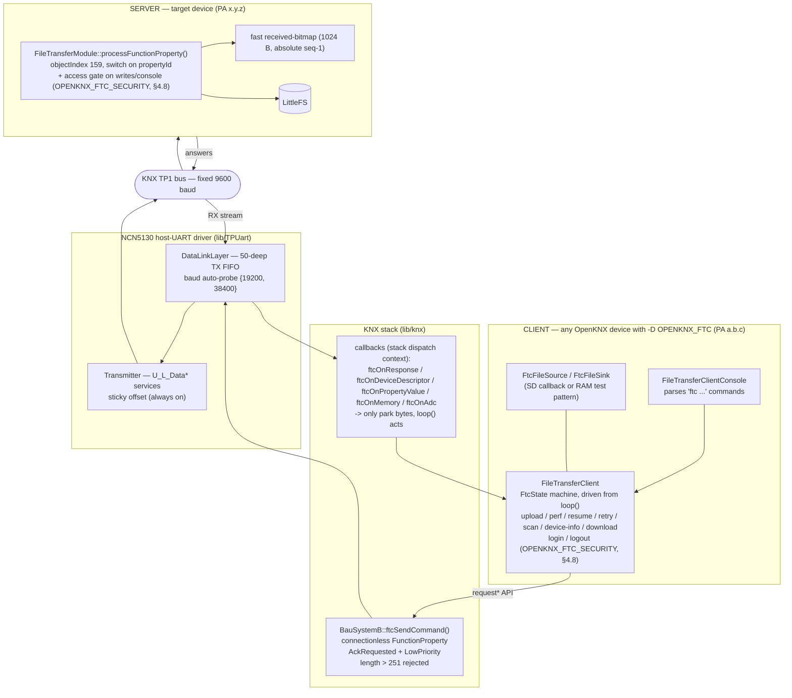
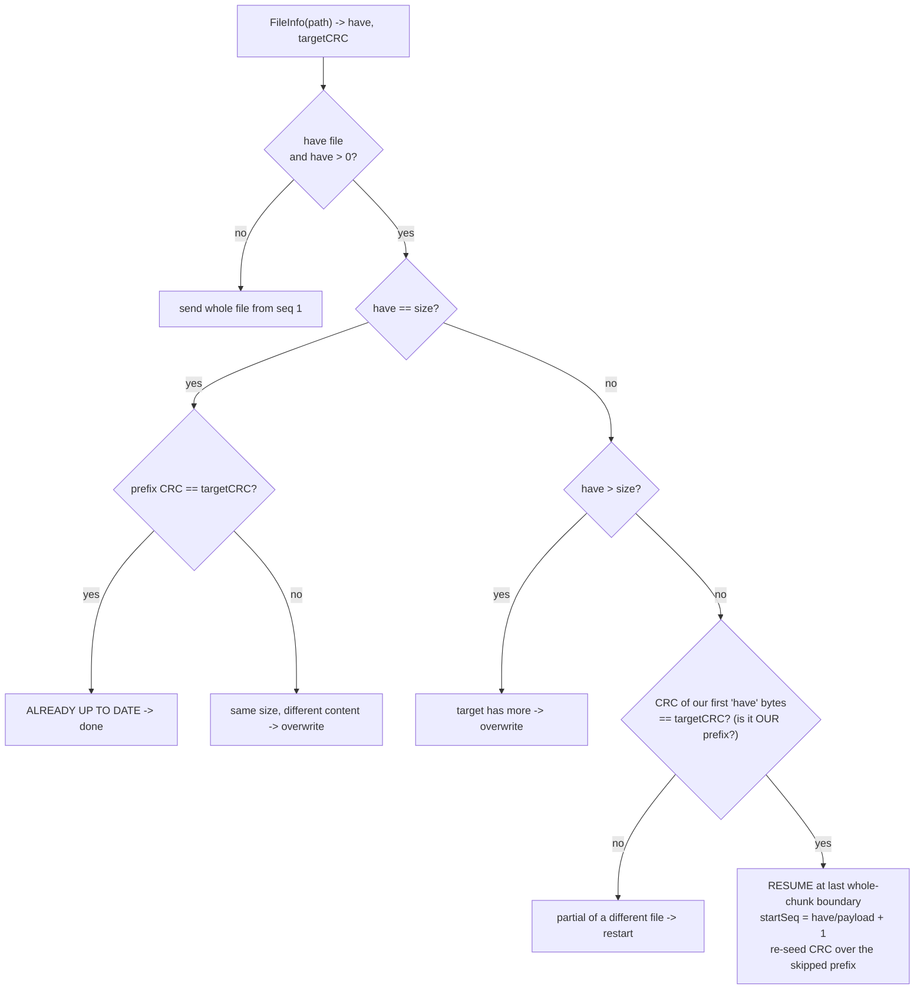

# FileTransferClient / FileTransferModule (FTC) — Engineering Reference

KNX file transfer over the bus, **PA → PA, with no PC in the chain**. One OpenKNX device
(the **client**) pushes or pulls a file to/from another device's **server**, driving a small
non-blocking state machine over the KNX application layer. This document is the definitive
description of the wire protocol, the transfer modes, resume/recovery/retry, the measured
throughput, and — most importantly — *why* it runs at the speed it does.

> Audience: a firmware engineer who has never seen this code. Everything below is cited against
> the real source (`file:line`); every measured number is from a real hardware run and is kept exact.
>
> **\* Throughput numbers are measured examples, not guarantees.** *All* B/s figures in this document (the
> `*` marks the tables) come from specific hardware; real-world speed varies with the TP1 line, the interface
> (host UART baud / SPI) and the setup — it can be **faster or slower** on any given system (the TP1 bus is
> the ~650 B/s host-side ceiling).

---

## TL;DR (for the impatient)

- **What:** copy a file **device → device over the KNX bus, no PC in the middle** — one OpenKNX device
  (the *client*) pushes or pulls a file to/from another device's *server*, plus a firmware update and an
  optional remote console. Everything runs from `loop()`; nothing blocks and nothing calls `delay()`.
- **Two modes:** `safe` (stop-and-wait, one answer per chunk — always correct, the default) and `fast`
  (a windowed stream with gap reports — fewer round trips on a clean link). Use `safe` unless you know the
  link is quiet; `fast` transparently falls back to classic against an old server or an oversized file.
- **~350–480 B/s over TP1 is normal — the wire and the chip link are the limit, not the code.** TP1 is a
  fixed 9600-baud bus, and the MCU↔NCN5130 host UART is *store-and-forward*: at 19200 host baud the NCN
  needs **~80 ms just to push a normal telegram into the chip** *before* it reaches the bus, ~40 ms at
  38400 — and that time adds **in series** with the bus time (§7). The only faster host links are a
  **38400 strap** or **SPI**, both hardware — there is **nothing to change in firmware**. For real KB/s,
  use KNXnet/IP, not TP.
- **Integrity:** every frame carries a CRC16; the whole file is proven with a CRC32/POSIX verify at the
  end. Resume, per-chunk retry and transient whole-transfer auto-retry are built in — a bad file is never
  accepted silently.
- **Bigger `pkg` = faster.** `pkg 254` (the spec-legal APDU max) is the sweet spot; only go smaller for a
  device on the path that advertises a smaller max-APDU.
- **Build:** add the module → the device is a *target*. `-D OPENKNX_FTC` adds the on-device `ftc` client,
  `-D OPENKNX_FTC_CONSOLE` the remote console (pulls in access control). Strip to the FW-update+transfer
  core with `-D OPENKNX_FTC_MINIMAL`. The full switch table is in the
  **[README](README.md#build-switches-feature-gates)** (§10).
- **The red "Ungültiger Frame" flood in the ETS busmonitor during a transfer is harmless** — a passive
  sniffer cannot decode the long private frames; nothing is mis-written (§4.7).

---

- **Client:** `src/FileTransferClient.{h,cpp}` (+ `FileTransferClientConsole.{h,cpp}` for the `ftc` console) — behind `-D OPENKNX_FTC`.
- **Server:** `src/FileTransferModule.{h,cpp}` — compiled on any RP2040/ESP32 target (writes to LittleFS).
- **Transport:** `lib/knx/src/knx/bau_systemB.cpp` (`ftcSendCommand` + response callbacks) and `lib/knx/src/knx/bau091A.cpp` (`ftcTxQueueSize`).
- **Wire driver:** `lib/TPUart/src/TPUart/{Transmitter,DataLinkLayer}.cpp` (NCN5130 host-UART).

**Related docs:** the interactive console tunnel has its own page —
[`FTC-Console.md`](FTC-Console.md); access control / password gate —
[`FTC-Security.md`](FTC-Security.md); the native desktop client —
[`../ftc-cli/README.md`](../ftc-cli/README.md); the build-switch table —
[`../README.md`](../README.md#build-switches-feature-gates).

---

## Table of contents

- [TL;DR (for the impatient)](#tldr-for-the-impatient)
1. [Overview](#1-overview)
2. [Architecture](#2-architecture)
3. [Transfer modes](#3-transfer-modes)
   - [3.1 `safe` vs `fast` in detail — and under bus load](#31-safe-vs-fast-in-detail--and-how-each-behaves-under-bus-load)
   - [3.2 The console tunnel in one paragraph](#32-the-console-tunnel-in-one-paragraph-detail-in-111)
4. [Wire protocol](#4-wire-protocol)
5. [Resume, recovery & auto-retry](#5-resume-recovery--auto-retry)
6. [Throughput & measurements](#6-throughput--measurements)
7. [The bottleneck (the key section)](#7-the-bottleneck)
8. [Optimizations & fixes](#8-optimizations--fixes)
9. [Metrics & reporting](#9-metrics--reporting)
10. [Build flags & configuration](#10-build-flags--configuration)
11. [Console usage](#11-console-usage)
12. [Known limits & future work](#12-known-limits--future-work)
13. [Glossary / abbreviations](#13-glossary--abbreviations)

---

## 1. Overview

FTC is two halves of the same OFM:

| Role | Class | Runs on | Responsibility |
|---|---|---|---|
| **Client** | `FileTransferClient` | any OpenKNX device built with `-D OPENKNX_FTC` (e.g. an IP-Interface / IP-Router, but not limited to them) | Drives the transfer: opens, streams chunks, reports progress, verifies, resumes, retries. Reads the source locally (SD via a callback, or a built-in RAM test pattern). |
| **Server** | `FileTransferModule` | any OpenKNX device with the module added (e.g. a KNeoPix) | Receives the frames, writes them to **its own** LittleFS, answers CRCs, gap reports and filesystem capacity. The client never touches the target's filesystem directly. |

The client speaks a **connectionless** dialect of the KNX *FunctionProperty* command
(`T_Data_Individual`, no connection is ever opened — see §2). Everything is driven from `loop()`;
**nothing blocks and nothing calls `delay()`**, because the device must keep serving the bus
and feeding its watchdog while a multi-minute upload is in flight.

The source is reached through a callback triple so the client needs no SD header
(`FileTransferClient.h`):

```c
struct FtcFileSource {                                    // upload source (read side)
    int32_t (*open)(const char *path);                    // returns file size, or -1 on failure
    uint8_t (*read)(uint32_t offset, uint8_t *buf, uint8_t len);
    void    (*close)();
};
struct FtcFileSink {                                      // download sink (write side)
    bool (*open)(const char *path);
    int  (*write)(const uint8_t *buf, uint16_t len);
    void (*close)();
};
```

On a device with **no SD card** (a typical interface / router build) only the RAM test pattern
(`ftc <pa> send test`, `ftc <pa> perf`) is available — which is exactly what the throughput A/B needs.

---

## 2. Architecture

### 2.1 Layer stack



Key transport facts (`bau_systemB.cpp`):

- **Connectionless.** No `isConnected()` gate — the reference clients (KnxFileTransferClient /
  Kaenx.Konnect) send plain `T_Data_Individual` and never open a KNX connection. Gating on a
  connection we never open would reject every frame. It also means FTC must **never** call
  `disconnect` — `_connectedTsap` is global stack state and could belong to someone else's ETS session.
- **`AckRequested`.** Every command (including the *silent* fast DATA frames) is sent AckRequested,
  so TP1 layer-2 keeps doing `L_ACK` / `BUSY` / retransmit — the only flow-control backstop left.
- **`LowPriority`, not `SystemPriority`.** A firmware upload is minutes of frames; at SystemPriority
  it would win every bus arbitration and starve time-critical group traffic (switching, alarms). Low
  lets FTC yield to everything else. The server echoes the request priority, so the answers are Low too.
- **Stack-overflow guard.** `ftcSendCommand()` rejects `length > 251` *before* the send
  (`bau_systemB.cpp`): `functionPropertyCommandRequest()` builds a stack-local `CemiFrame(3+length)`
  and `memcpy`s into a 264-byte buffer at APDU offset 13, so the payload must fit `264 − 13 = 251` bytes.
  `length` is caller-controlled (a fast DATA frame is `5 + n`), so it is bounded hard.

### 2.2 Dispatch-context rule

The five response callbacks (`ftcOnResponse`, `ftcOnDeviceDescriptor`, `ftcOnPropertyValue`, `ftcOnMemory`,
`ftcOnAdc`) fire **inside the KNX stack's own dispatch**. They do the absolute minimum — copy the bytes into a buffer
and set a `volatile` flag — and return. The state machine reads that flag in the next `loop()` tick
and does the file I/O and the follow-up send there. Doing I/O or a send from inside the callback would
re-enter the application layer from within its own callback. Scan answers use a small
single-producer/single-consumer ring (`_ftcDdQ[16]`) because two devices can answer back-to-back
between two `loop()` ticks and a single slot would drop one.

### 2.3 The `loop()` state machine

`FtcState` (`FileTransferClient.h`) has ~30 states. Grouped by job:

```
                         ┌───────────────────────────────────────────────────────────┐
                         │                        FtcIdle                            │
                         └───┬───────────┬──────────┬──────────┬─────────┬───────────┘
      ping ──────────────────┘           │          │          │         │
        FtcSent                          │          │          │         │
                                         │          │          │         │
     upload/perf (mode 1)   ── FtcFeatureProbe ──┐  │          │         │
     upload/perf (all modes) ─────────── FtcResumeInfo (pre-upload FileInfo -> resume decision)
                                              │
                   ┌── mode 0 (classic) ──────┤────── mode 1 (fast / windowed) ──┐
                   │                          │                                │
        FtcUploadOpen                         │                        FtcFastOpen
        FtcUploadChunk  <──┐                  │                        FtcFastStream  (pump, SILENT data)
        FtcUploadChunkRetry┘                  │                        FtcFastReport  (cmd45 gap bitmap)
        FtcUploadClose                        │                        FtcFastResend  (resend gaps)
                   │                          │                        FtcFastClose
                   └──────────────► FtcVerify (whole-file CRC32) ◄──────────────┘
                                        │
                            FtcPerfCleanup (perf only) ─► FtcIdle

   other jobs: FtcInfo · FtcFsInfo (df / ll footer / pre-upload space check) · FtcDelete (rm/mkdir/rmdir/mv/format)
               FtcDirList/FtcDirInfo (ll/ls) · FtcScan · FtcDevDescr/Ver/Feat/Prop/Enum/Load (device info)
               FtcDownloadOpen/Chunk · FtcCancel (drain + auto-retry re-entry point)
   access control (OPENKNX_FTC_SECURITY, §4.8):
               login:  FtcAuthProbe (CheckFeatures: is it password-protected?) ─► FtcAuthChallenge (get nonce)
                       ─► FtcAuthResponse (send 4-byte MAC) ─► FtcIdle
               logout: FtcAuthResponse (cmd 105) ─► FtcIdle
```

Every waiting state has the same shape: *if a response is pending, consume + validate + advance;
else if `millis() − _ftcSince > timeout`, time out.* `FTC_TIMEOUT = 6000 ms` for most states;
the fast path uses tighter, purpose-built deadlines (§3, §5). The two auth challenge/response states use
`FTC_TIMEOUT`; the login pre-flight (`FtcAuthProbe`) uses the short `FTC_FEATURE_TIMEOUT` like the other
CheckFeatures probes.

`loop()` itself is a thin dispatcher: a common preamble (pending-response validation, timeouts) + the
core stop-and-wait transfer inline, then it hands off to one **per-feature handler** per job group —
`loopDownload` / `loopFast` / `loopDirOps` / `loopScan` / `loopDeviceInfo` / `loopSecurity` / `loopConsole`.
The split is pure code motion (behaviour-identical); it also lets the client sub-gates (`OPENKNX_FTC_SCAN`
/ `_DEVICEINFO`, §10) compile a whole handler in or out cleanly.

---

## 3. Transfer modes

The upload command takes a **mode** (`ftc <pa> send <src> [pkg] [mode]`), `safe` (0) or `fast` (1):

| | **mode 0 — safe / classic** | **mode 1 — fast / windowed** |
|---|---|---|
| Command | `FileUpload` (40) | `FileUploadFast` (44) |
| Flow control | stop-and-wait: one request → one answer **per chunk** | AIMD window `[4..64]`, per-window gap report |
| Answer per DATA frame | yes (5-byte `[result][seq][crc16]`) | **none** (silent; L2 ACK only) |
| Mid-stream reports | — | `FileReport` (45) after each window |
| Integrity per frame | CRC16 echoed & compared | trailing CRC16 in the frame, checked on target |
| Payload/chunk | `pkg − 6` | `pkg − 8` (2 B reserved for in-frame CRC16) |
| Pacing | implicit (waits for each answer) | TP-FIFO high/low water (`FTC_TX_HIGH=30`, `FTC_TX_LOW=1`); per-`loop()` burst `FTC_FAST_BURST_RAM=16` / `_SD=4` |
| Recovery | per-chunk retry (`_cfgMaxRetries`, default 3) | resend the window's missing seqs (per-window gap report) |
| When to use | always correct; the safe default | quiet link, want fewer round trips; pin the window with `fast w<N>` |
| Measured @19200 (50 KB) \* | **349 B/s** | **366 B/s** |

> An earlier third mode ("forget" — one giant silent window) was **removed**: on a real bus it needs a
> whole-file recovery net, wins nothing over `fast`, and only adds crash risk under a burst. `fast` (a
> paced, windowed stream that recovers per window) is its safe replacement. `ftc <pa> send … fast w<N>`
> pins the AIMD window to a fixed `N` so an end-of-transfer burst can't overrun a slow sink.

**Negotiation.** A non-classic mode is not blind. The client first sends `CheckFeatures` (102) with a
short **800 ms** window (`FTC_FEATURE_TIMEOUT`, *not* the 6 s `FTC_TIMEOUT`, so an old server that
never answers cmd102 falls back fast). It gates on:

- no answer (old server) → **downgrade to classic**;
- `FAST` bit (`0x04`) clear → **downgrade to classic**;
- file needs more chunks than `FTC_FAST_MAX_CHUNKS = 8192` → **downgrade to classic**.

A downgrade is logged once (`FileTransferClient.cpp`). A per-PA feature cache
(`_ftcFeatValid/_ftcFeatPa/_ftcFeatBits`) skips the re-probe for the rest of the session; only a *real*
answer is cached (a probe timeout is not — it may be transient and must not pin a device to classic).

Because a fast frame reserves 2 bytes for its in-frame CRC16, the *wire* frame is the same proven size
in all modes: classic `pkg−6` payload + 6 overhead, fast `pkg−8` payload + 6 + 2 CRC. If a fast request
is downgraded, the classic path just runs with 2 fewer payload bytes — still 100 % correct, marginally
less efficient (`FileTransferClient.cpp`).

### 3.1 `safe` vs `fast` in detail — and how each behaves under bus load

At a glance:

| | **`safe` (mode 0)** | **`fast` (mode 1)** |
|---|---|---|
| Flow control | stop-and-wait: send 1 chunk, wait for its answer | burst a window (silent), then one `FileReport` reconciles it |
| Outstanding at once | exactly 1 | a whole window (`FTC_WND` 4..64, AIMD) |
| Answer per DATA frame | yes (`[result][seq][crc16]`) | none (silent; only the TP1 L2 ACK) |
| Pacing | implicit — waits for each answer | window water-marks + the target's reported ingest rate |
| Recovery grain | per **chunk** (retry on the spot) | per **window** (resend the reported gaps) |
| On a **quiet** bus | steady ~350 B/s | slightly faster (fewer round trips) |
| On a **flooded** bus | **grinds through** (self-paces, chunk-granular retry) | fragile — the burst overruns → lossy windows → resend rounds |
| Speed ceiling | the wire (§7) | the wire (§7) — same ceiling, `fast` just hides answer latency |
| Integrity per frame | CRC16 echoed & compared | trailing CRC16 checked on the target |
| Final proof | whole-file CRC32 verify | whole-file CRC32 verify (identical) |
| Knobs | `retry max/transfer/backoff` | + `fast w<N>` (pin the window) |
| Best for | shared / noisy bus, slow SD/EFC sink, the default | a quiet link you control, fewer round trips |

The detail behind that table:

Both modes move the *same* frames and end with the *same* whole-file CRC32 verify (§4.4). The only
difference is **when the client waits**, and that single choice decides how each behaves when the bus
gets busy.

**`safe` (classic, mode 0) — one chunk, one answer, repeat.**
The client sends chunk *n*, then **waits for that chunk's answer** (`[result][seq][crc16]`) before it
sends chunk *n+1*. It is a strict stop-and-wait lockstep:

- **Self-pacing.** Because it never sends ahead, it automatically runs at exactly the rate the bus + the
  target's flash write can sustain — there is no window to overrun. On an idle bus and a busy bus it does
  the same thing, just slower on the busy one.
- **Chunk-granular recovery.** A lost or CRC-bad frame is caught by *its own* answer and re-sent on the
  spot (`_cfgMaxRetries`, default 3); nothing downstream is affected.
- **Survives a flooded bus.** When a third device floods the line (e.g. non-stop group writes), `safe`
  simply takes longer per chunk and **grinds through** — it was measured to complete on a bus busy enough
  to break the windowed path.
- **Cost:** one full bus round-trip per chunk → the ~350 B/s floor. This is the right default and the
  right tool whenever the bus is shared/noisy or the sink is slow (SD/EFC).

**`fast` (windowed, mode 1) — burst a window, then reconcile.**
The client streams a whole **window** of chunks back-to-back (**silent** DATA frames — no per-chunk L7
answer, only the TP1 L2 ACK), then sends **one** `FileReport` (45) and gets back a received-bitmap naming
exactly which seqs of that window landed. It re-sends only the gaps, then opens the next window:

- **AIMD window.** A clean window grows `+8` (up to `FTC_WND_MAX=64`); any loss **halves** it (down to
  `FTC_WND_MIN=4`). So on a good link it climbs to few round-trips-per-many-chunks; on a lossy link it
  backs off toward small windows automatically.
- **Fewer round trips = faster on a quiet link** — but only marginally over TP (§6): the wire, not the
  round-trip count, is the ceiling. `fast` mainly helps by hiding the per-chunk answer latency.
- **Fragile to a flooded bus — by nature.** A burst assumes the window will mostly arrive. When another
  device is already saturating the line, the burst **overruns delivery** → lossy windows → repeated resend
  rounds. Progress still happens, just inefficiently. Pin the window (`fast w<N>`) to cap the burst so its
  tail can't pile onto a slow sink.
- **Guarded against a genuine wedge, not against slowness.** Two independent guards keep it honest without
  false-aborting a slow-but-progressing transfer:
  - a **no-progress** guard (`FTC_NOPROGRESS_MAX=4`): the received-bitmap is monotonic, so the missing
    count can only shrink; if it fails to shrink across 4 reports the seqs are persistently dead → abort;
  - a **progress-based stall deadline** (`FTC_FAST_STALL_MS=30 s`), **re-armed on every advancing chunk
    *and* on every report that shows the missing count shrinking** — so a lossy-but-progressing window on a
    congested bus is never killed, while a fully-silent target still hits the bounded report timeout.

**Rule of thumb.** `safe` = correctness and robustness under load (the default, and the only sane choice
over a busy/shared bus or a slow SD/EFC sink). `fast` = fewer round trips on a **quiet** link you control;
pin it with `w<N>` if the tail overruns. Neither can beat the ~350–480 B/s TP ceiling (§7) — that is the
wire, not the mode. Both prove the file with the same CRC32 verify, so **`fast` is never *less safe* than
`safe`** — a mismatch is reported as FAILED, never accepted.

### 3.2 The console tunnel in one paragraph (detail in §11.1)

`ftc <pa> console` is a *separate* channel (object 160, not the 159 command table) that mirrors the
remote device's own OpenKNX console over the bus: you type `mem`/`fs`/`info`/… locally, the target runs
them and streams its output back until `quit`. It is strict lockstep too — the client parks one input line
(`PID_IN`) and drains the target's bounded log ring one bounded chunk per `loop()` pass (`PID_OUT`), so it
**tolerates a congested bus** the same way `safe` does (it just drains slower) and never blocks either
device's `loop()`. One logical session at a time; an idle session is reaped; the remote command itself runs
under the target's `freeLoopTime()`. Opt-in behind `OPENKNX_FTC_CONSOLE` (which pulls in access control).

---

## 4. Wire protocol

### 4.1 Command IDs (FunctionProperty `propertyId` on object index **159**)

Object index `159` is hard-required — the server rejects anything else (`FileTransferModule.cpp`).
The enum is sparse (`FileTransferModule.cpp`); an unknown id is silently ignored (the server only
answers `if (handled)`). Object index **160** is a *separate* interface used only by the optional console
tunnel (§11.1, `OPENKNX_FTC_CONSOLE`) — it does **not** extend this 159 command table.

| ID | Name | Direction | Answered? | Purpose |
|---:|---|---|---|---|
| 0 | `Format` | → | yes | `LittleFS.format()` — wipes **all** files + folders |
| 1 | `Exists` | → | yes | `LittleFS.exists(path)` |
| 2 | `Rename` | → | yes | `mv` (payload `old\0new\0`) |
| 40 | `FileUpload` | → | yes | classic upload: seq 0 = open, `0xFFFF` = close, else data |
| 41 | `FileDownload` | → | yes | pull a file: open then per-chunk |
| 42 | `FileDelete` | → | yes | `rm` |
| 43 | `FileInfo` | → | yes | size + CRC32 of a file |
| **44** | `FileUploadFast` | → | open/close **yes**, data **no** | fast upload (silent data) |
| **45** | `FileReport` | → | yes | received-bitmap gap query |
| 46 | `FilesystemInfo` | → | yes | LittleFS total + used bytes (`df`, the `ll` footer, the pre-upload space check) |
| 80 | `DirList` | → | yes | stateful iterator, one entry per round trip |
| 81 | `DirCreate` | → | yes | `mkdir` |
| 82 | `DirDelete` | → | yes | `rmdir` |
| 90 | `Cancel` | → | **no** | close the target's open file/dir (drain then finish) |
| 100 | `ModuleVersion` | → | yes | 6-byte major/minor/revision — also the `ping` |
| 101 | `FwUpdate` | → | no | RP2040 only: `picoOTA` + reboot |
| 102 | `CheckFeatures` | → | yes | 1 byte: bit0 Resume, bit1 Update, bit2 FAST, bit3 Console, **bit4 AuthRequired, bit5 WritesDisabled** |
| **103** | `AuthChallenge` | → | yes | access control: request a nonce → `0x00` + 16-byte nonce (`OPENKNX_FTC_SECURITY`) |
| **104** | `AuthResponse` | → | yes | access control: submit the 4-byte MAC over the nonce → `0x00` ok / `0xA1` fail |
| **105** | `AuthLogout` | → | yes | access control: close the authorized window now → `0x00` |

Commands 103–105 and the CheckFeatures bits 4/5 exist only when the server is built with
`-D OPENKNX_FTC_SECURITY`; an older/unflagged server ignores 103–105 (§4.8) and never sets bits 4/5.

A few operations ride the KNX application layer directly (**not** object 159): `DeviceDescriptor_Read`
(2-byte mask → device class) and `PropertyValue_Read` (Device-Object identity properties) for scan +
device-info, and a `PropertyValue_Write` to the Device Object's prog-mode property for the `led` locate
command (§11). See `bau_systemB.cpp`.

### 4.2 Endianness — the one real trap

The protocol is **deliberately asymmetric** and getting it wrong looks exactly like a sequence
mismatch (`FileTransferClient.cpp`):

| Field | In the **request** | In the **answer** |
|---|---|---|
| chunk sequence | **little**-endian (`data[1]<<8 \| data[0]`) | **big**-endian (`pushWord`) |
| per-frame CRC16 | — | **big**-endian |
| fast DATA trailing CRC16 | **big**-endian (over `seq+len+payload`) | — |
| report `base` / `count` | **little**-endian | **big**-endian (echoed) |
| FileInfo `size` / `crc32` | — | **big**-endian |

### 4.3 Frame layouts (byte-by-byte)

**Classic upload — `FileUpload` (40)** (`FileTransferClient.cpp`, `FileTransferModule.cpp`)

```
OPEN   req : [00][00][payloadSize][flags][path... 00]      flags: 0=truncate("w"), 1=resume("r+"), >1 -> 0x42
       ans : [00]                                          1 byte; 0x00 ok, 0x42 open failed
DATA   req : [seqLo][seqHi][n][payload:n]                  seq little-endian, n = payload length
       ans : [result][seqHi][seqLo][crcHi][crcLo]          5 bytes; seq & CRC16 big-endian
CLOSE  req : [FF][FF]
       ans : (empty, resultLength = 0)                     arrival is the whole signal
```

**Fast upload — `FileUploadFast` (44)** (`FileTransferClient.cpp`, `FileTransferModule.cpp`)

```
OPEN   req : [00][00][payloadSize][flags][expLo][expHi][path... 00]
             flags bit0 = resume(r+), bit1 = keepBitmap (recovery re-open); expectedChunks little-endian
       ans : [00] ok  |  [42] open failed  |  [4A] too many chunks (> 8192 -> client goes classic)
DATA   req : [seqLo][seqHi][n][payload:n][crcHi][crcLo]    SILENT; trailing CRC16 (Modbus) big-endian over seq+len+payload
       ans : NONE                                          server returns false -> no L7 answer; L2 still ACKs
CLOSE  req : [FF][FF]
       ans : [00]                                          1 byte
```

The server sets the received bit for a seq **only after** the trailing CRC16 verifies *and* the
position-write succeeds — so "bit set" ⇔ "the correct bytes are on disk" (`FileTransferModule.cpp`).
A malformed/short frame, a CRC miss, or an out-of-range seq leaves the bit clear → a recoverable gap.

**Gap report — `FileReport` (45)** (`FileTransferModule.cpp`)

```
req : [baseLo][baseHi][cntLo][cntHi][nonce]                base/count little-endian
ans : [00][baseHi][baseLo][cntHi][cntLo][nonce][bitmap...][bpsHi][bpsLo]
      base/count big-endian echo; nonce echoed
      bitmap = ceil(count/8) bytes, bit i (LSB-first) = seq (base+i) received
      [bpsHi][bpsLo] = the target's MEASURED ingest rate (new bytes written / interval, B/s, big-endian),
                       appended only when it still fits the frame; the client uses it to pace the next window
```

`count` is clamped so the answer stays in one frame: `resultLength = 6 + ceil(count/8) ≤ 247`
⇒ **`count ≤ 1928`**. The nonce lets the client reject a stale/mirrored report. The 2-byte ingest-rate
trailer is **backward-compatible** — an old client simply stops reading at the bitmap.

**FileInfo — (43)** (`FileTransferModule.cpp`)

```
req : [path... 00]
ans : [00][sizeB3..sizeB0][crcB3..crcB0]   9 bytes, big-endian: status 0x00 = size + whole-file CRC32
    | [02][sizeB3..sizeB0]                 5 bytes: CRC still computing (LittleFS, cooperative) -> poll again
    | [01][sizeB3..sizeB0]                 5 bytes: size only, no whole-file CRC (SD / ext-flash target)
    | [42]                                 1 byte -> file not found
```

The whole-file CRC32 on LittleFS is computed **cooperatively** (a few KB per `loop()` pass, never a
blocking whole-file read in the KNX dispatch — a VORGABE, and it stops a large file from tripping the
watchdog). So FileInfo first answers `0x02` (**computing**, size already known) and the client re-queries
until it flips to `0x00` (size + CRC). On an **SD / external-flash** target the whole-file CRC is skipped
(too slow to scan on demand) and FileInfo answers `0x01` (**size only**); the client then verifies by size
and reports "size OK, not verified (SD/EFC)" instead of a CRC match (§5.1, §9). An old server answers a
plain `0x00`/`0x42` and the client handles it unchanged.

**FilesystemInfo — (46)** (`FileTransferModule.cpp`)

```
req : (no payload)
ans : [00][totalB3][totalB2][totalB1][totalB0][usedB3][usedB2][usedB1][usedB0]   9 bytes, big-endian
    | [1-byte error / no answer]   old server without the command -> client degrades gracefully (§5.4)
```

Read-only (`LittleFS.info()` on RP2040/RP2350, `totalBytes()/usedBytes()` on ESP32) — never touches an
open file/dir, safe any time. The client derives `free = total − used`.

**Download — `FileDownload` (41)** (`FileTransferClient.cpp`, `FileTransferModule.cpp`)

```
OPEN  req : [00][00][pkg][path... 00]        pkg default = FTC_DL_PAYLOAD = 240 (get can override 16..240)
      ans : [00][sizeB3..sizeB0]             size big-endian (5 bytes on the wire)
CHUNK req : [seqLo][seqHi]                   seq little-endian
      ans : [00][seqHi][seqLo][readed][data:readed][crcHi][crcLo]   seq & CRC16 big-endian; readed<pkg = last chunk
```

**DirList — (80)**: `req [dir\0]` → `ans [00][type][name...]`, `type` 0 = no more, 1 = file, 2 = directory.
**ModuleVersion — (100)**: `ans [majHi][majLo][minHi][minLo][revHi][revLo]`.
**CheckFeatures — (102)**: `ans [flags]`, `0x01` Resume, `0x02` Update (RP2040), `0x04` FAST.

### 4.4 The two CRCs

| CRC | Parameters | Where | Purpose |
|---|---|---|---|
| **CRC-16/MODBUS** | init `0xFFFF`, reflected poly `0xA001` | every classic DATA answer, every fast DATA trailer, every download chunk | per-frame integrity (`FastCRC16::modbus`) |
| **CRC-32/POSIX** | poly `0x04C11DB7`, init 0, no reflect, **xorout `0xFFFFFFFF`** | `FileInfo` (43), the final verify | whole-file end-to-end proof (`FastCRC32::cksum`) |

The whole-file CRC is **POSIX `cksum`, not zlib** (`FileTransferClient.cpp`). The client folds
the source into `_ftcSrcCrc` as it sends (fold-once via a watermark so resends don't double-count) and
at the end compares `_ftcSrcCrc ^ 0xFFFFFFFF` against the target's `FileInfo` CRC. "Bytes arrived" is
not "the *right* bytes arrived" — the verify is the only honest proof.

### 4.5 Result codes (`doc/errorcodes.txt` + server)

| Code | Meaning | | Code | Meaning |
|---|---|---|---|---|
| `0x00` | OK | | `0x47` | short write — **filesystem full** |
| `0x01` | `LittleFS.begin()` failed | | `0x4A` | fast: too many chunks → go classic |
| `0x02` | `LittleFS.format()` failed | | `0x81` | dir already open |
| `0x03` | LittleFS not initialized | | `0x82` | dir can't be opened |
| `0x04` | requested pkg > max resultLength | | `0x83` | dir not opened |
| `0x41` | file already open | | `0x84` | dir can't be deleted |
| `0x42` | file can't be opened | | `0x85` | dir can't be created |
| `0x43` | file not opened | | `0x86` | dir has no more files |
| `0x44` | file can't be deleted | | `0xA0` | **auth required** (run `login`) |
| `0x45` | file can't be renamed | | `0xA1` | **auth failed** (wrong/empty password) |
| `0x46` | seek failed | | `0xA2` | **writes disabled** (stage Off / not in prog mode) |

`0xA0/0xA1/0xA2` appear only against an `OPENKNX_FTC_SECURITY` server (§4.8). An old client that does not
know them treats them as a generic rejection (fails safe, no crash).

### 4.6 Server write core

Every write — classic *and* fast — goes through one position-write
(`FileTransferModule.cpp`):

```c
bool writeChunk(uint16_t sequence, const uint8_t *payload, uint8_t n) {
    if (!_file.seek((uint32_t)(sequence - 1) * _size)) return false;   // absolute offset
    return _file.write(payload, n) == n;
}
```

It seeks on **every** call (no continuity shortcut): the fast path writes out of order and a resend of
the same seq must land at its absolute offset. An in-order seek to the current position is a no-op in
LittleFS, so this is free on the classic stream. `_size` is the payload-per-chunk the client sent in
the open frame — the client's `pkg` accounting and the server's seek stride must agree, which is why
`payloadSize` is mirrored in the open.

### 4.7 What the ETS bus monitor shows during a transfer — "Ungültiger Frame" & phantom telegrams (harmless)

> **TL;DR for the non-expert:** watching an FTC transfer in the ETS *Busmonitor* you will see a flood of
> red **"Ungültiger Frame" / "Invalid frame"** and, now and then, a scary-looking **phantom** telegram
> (an `A_Memory_Write` or a `GroupValueWrite`) addressed to devices/GAs that **don't exist** in your
> project. **Nothing is being written anywhere — it is a sniffer display artifact. The transfer is fine.**

**Why it happens.** An FTC data chunk carries **240–250 payload bytes** (§4.3, §6.4). That does not fit a
*standard* KNX frame (max ~15-octet APDU), so every data frame is a **KNX extended L_Data frame**
(`octetCount > 15` ⇒ extended, `cemi_frame.cpp:410`) carrying the FTC payload on its **private object 159**.
For a passive sniffer like the ETS monitor, two things follow:

1. It **cannot decode** the long FTC payload (a private FunctionProperty on obj 159 with 240 B of file
   data) as any standard KNX service → it flags the frame **"Ungültiger Frame"**.
2. In **fast** mode the data frames are **silent, back-to-back bursts** (§3 — no per-frame answer).
   A monitor that delimits the wire by *timing* can slip its frame boundary inside a burst and parse
   **mid-telegram**, reading file bytes as a frame header. Firmware (`.gz`) bytes are high-entropy, so once
   in a while they line up into a **valid-looking** standard telegram → the **phantom** Memory_Write /
   GroupValueWrite. Its source/dest/GA are *file data*, not real addresses.

**Proof it is benign** (from a real trace):

- The **real** frames are point-to-point `client ↔ target` (e.g. `5.0.0 ↔ 5.0.3`), sent **`AckRequested`**
  (§2.1), so TP1 layer-2 **`LL_ACK`s every one** — the ACK is visible in the monitor.
- The data frames are **exactly correlated** to the requests: a request `ObjectIndex=159 PropertyId=41
  Data=DB03` (pull seq `0xDB`) is answered by an "invalid" frame whose raw bytes contain
  `… 9F 29 00 03 DB F0 …` = obj `0x9F`(159), pid `0x29`(41), seq `DB`, then the data marker `F0` + payload.
  It is the requested chunk, not noise.
- The transfer ends with a **CRC32/POSIX verify OK** (§4.4). A genuinely malformed frame leaves the
  server's received-bit clear (§4.3) and the file fails to verify — which does not happen.
- Real KNX devices frame by **length + checksum**, not by timing, so they never misframe; and every FTC
  frame is individually addressed to the target's PA, so **no other device even processes it** (wrong
  individual address). The phantom PA/GA is never actually on the wire.

**Rule of thumb.** During an FTC transfer, **any monitor line with blank device names** (empty
*Quellname/Zielname*) and an unfamiliar address (`1.3.171`, `7.0.105`, `13/0/29`, …) is a **sniffer
misframe — ignore it**. The only *real* FTC traffic is the `client ↔ target, ObjectIndex=159` lines, each
with `LL_ACK`.

**Nothing to fix.** This is inherent to moving bulk data over KNX (big chunks ⇒ extended frames). No FTC
mode avoids it — even `safe` uses 247-byte chunks; shrinking to a ≤14-byte APDU would make every frame
ETS-decodable at ~15× the transfer time, which is pointless. FTC file transfer is the one tolerated
exception to "standard KNX services only" (§4.1), and this monitor cosmetics is a direct consequence.

### 4.8 Access control (`OPENKNX_FTC_SECURITY`, opt-in)

A **coarse deterrent** — a lock, not an alarm system — that gates the FTC **write** surface (upload, format,
rm, mkdir, rmdir, mv, fw-update) and the console take-over, so an unauthorized user on the network cannot
write without a password. Reads stay open (except stage "Off"). It is **not** KNX Secure. Wire-level: cmds
103/104/105 (§4.1), CheckFeatures bits 4/5, and result codes `0xA0`/`0xA1`/`0xA2` (§4.5). Everything is
behind `-D OPENKNX_FTC_SECURITY`; without the flag the module + client compile byte-identical.

> **Full detail — the login/auto-logout model, the AES challenge-response, the four stages and backward
> compatibility — is in [`FTC-Security.md`](FTC-Security.md).** Product-side ETS parameters + threat model:
> `OAM-IP-Interface/doc/FTC-SECURITY.md`.

---

## 5. Resume, recovery & auto-retry

Three independent safety nets, from finest to coarsest grain.

### 5.1 Resume (every upload starts here)

Every `send`/`resume`/`perf` runs a `FileInfo` **before** opening (state `FtcResumeInfo`,
`FileTransferClient.cpp`). Opening blindly with truncate would throw away a partial we could
have continued. The decision:



The prefix check matters: without it, a partial of a *different* file would transfer to completion and
only fail at the final verify — wasting the whole run and repeating on every retry. Resume continues at
the last **whole-chunk** boundary (`have / payloadSize`), never mid-chunk, so the seek stride stays exact.

### 5.2 Fast recovery (never accept a silently-bad file)

The fast mode's DATA frames are silent, so it recovers **inline, per window** rather than only at the end
(`FileTransferClient.cpp`): after each streamed window the client sends a `FileReport` (45); the answer's
received-bitmap names exactly which seqs of that window landed. `FtcFastResend` re-sends only those, then
re-reports the same window with a fresh nonce; only when the window is clean does it advance. The whole
file is folded into the source CRC once during the stream (fold-once via a watermark), so a resend never
double-counts the CRC.

**AIMD window** (`FileTransferClient.cpp`): a clean window grows `+8` (up to
`FTC_WND_MAX=64`); any loss halves it (down to `FTC_WND_MIN=4`). The halving sizes the *next* window —
the current window's high edge is frozen (`_ftcWndEnd`) when it opens, so halving can never orphan
already-streamed tail seqs. `fast w<N>` pins the window at a fixed `N` (loss still ratchets it down) so an
end-of-transfer burst cannot overrun a slow sink.

**No-progress guard** (`FTC_NOPROGRESS_MAX = 4`): the received-bitmap is monotonic, so the missing count
is non-increasing; if it fails to shrink across 4 reports the seqs are persistently dead → abort. This
replaced a fixed wall-clock deadline that false-aborted a slow-but-steady TP transfer (§8).

**Final gate.** At close the whole file is proven with the CRC32/POSIX verify (§4.4, `FtcVerify`). A
mismatch — in *either* mode — falls through to the summary with `ok = false` → the result box shows
**FAILED**; a bad file is never accepted silently, and self-apply (§9) is gated on a clean verify. A
*transient* abort before that (busy target, lost report/close) is picked up by the transfer-level
auto-retry (§5.3), which re-runs the whole transfer and resumes from the partial already on the target.

### 5.3 Transfer-level auto-retry

Most upload aborts are *transient* — the target briefly busy after a format's flash erase, a reboot,
a lost report or close. `ftcAbort()` (`FileTransferClient.cpp`) classifies the reason string:

- **Permanent** (fail immediately): contains `source` · `cannot read` · `refused` · `recovery failed` ·
  `no progress` · `too many` · `full` · `space` · `cancel`.
- **Transient** (everything else): if `_ftcUpload` **or `_ftcDownload`** and `_ftcTransferRetries <
  _cfgTransferRetries`, send `Cancel` (90) to close the target's partial, wait `_cfgBackoffMs` for a
  busy/rebooting target to settle, then **re-run the whole transfer** — which re-runs `FileInfo` and
  resumes from the partial already on the target.

Both bounds are **runtime-settable** (RAM-only, reset to the defaults on reboot) via
`ftc retry transfer <n>` / `ftc retry backoff <ms>` — see §11. Also `ftc retry max <n>` for the
**per-chunk** budget `_cfgMaxRetries` (§5.2). Defaults: `max 3`, `transfer 3`, `backoff 3000 ms`
(`FTC_MAX_RETRIES_DEF` / `FTC_TRANSFER_RETRIES_DEF` / `FTC_RETRY_BACKOFF_MS_DEF`). Setting `transfer 0`
disables the whole-transfer auto-retry.

The source is deliberately kept open across the retry (the retry re-enters `ftcStart`, not
`requestUpload`, and the resume path must re-read it; `read()` is stateless/offset-based, so a still-open
handle is safe). The retry budget resets only on a fresh `request*`, never inside `ftcStart`.

### 5.4 Pre-upload space check

Between the resume decision and the actual open, `ftcProceedToUpload()` runs a **one-time**
`FilesystemInfo` (46) query (state `FtcFsInfo`, purpose 1) to make sure the file will fit *before*
streaming a whole transfer that can only fail at `0x47` (fs full) near the end
(`FileTransferClient.cpp`, `2415-2433`). The check runs once per transfer and survives a retry
(`_ftcSpaceChecked`). The arithmetic:

```
need   = _ftcSize − _ftcResumeBase            # bytes still to write this run
credit = (_ftcResumeBase == 0) ? _ftcTargetHave : 0   # a truncate open("w") frees the old file; resume keeps its partial
avail  = free + credit                        # free = total − used, from the server answer
abort "not enough space on target filesystem"  IF  need + FTC_FS_MARGIN (8192) > avail
```

`_ftcTargetHave` is the existing target file's size, learned in `FtcResumeInfo`. The `8192`-byte margin
covers LittleFS block rounding + metadata. The abort reason contains `"space"`, which is in the
**permanent** set (§5.3, `ftcAbort` `strstr(reason,"space")`) — no auto-retry, because a retry cannot
create room.

**Graceful degrade / backward-compat.** An old server without command 46 answers a 1-byte error or
times out. In that case the check is skipped and **the upload proceeds anyway** (logged as
"uploading without the space check") — so it is safe against a KNeoPix running the old server. The same
degrade makes `df` and the `ll` footer silently omit the bar.

---

## 6. Throughput & measurements

All numbers below are **measured on real hardware** this session — target **KNeoPix at PA 5.0.3**,
a 50 KB `/ftcperf.bin` ramp, verified `CRC32/POSIX = 0x6F8129C7`.

### 6.1 Sustained TP throughput (over the 9600-baud KNX TP1 bus)

| Mode | File | Host baud | Throughput \* | Notes |
|---|---|---:|---:|---|
| classic (mode 0, stop-and-wait, per-chunk answer) | 50 KB | 19200 | **349 B/s** | 146.4 s, payload 247, 208 chunks |
| fast (mode 1, AIMD 8..64 + cmd45 gap reports) | 50 KB | 19200 | **366 B/s** | 139.8 s, payload 245, 209 chunks |
| fast (silent windowed stream) | 50 KB | **38400** | **478 B/s** | 107.0 s — **+30 %**, a 38400-strapped board |

The two modes land within ~5 % of each other at 19200 because **the wire, not the protocol, is the
limit** (§7). The jump to 478 B/s comes purely from doubling the *sender's* host-UART baud — nothing in the
protocol changed.

### 6.2 Numbers that will fool you (read this before quoting a speed)

- **A 16 KB windowed run "@26 KB/s" was the IP path, not TP.** That run went over KNXnet/IP routing
  (~75× faster than TP), not the TP1 bus. It is not a TP measurement.
- **fast 4 KB "@981 B/s" was a TX-FIFO-fill artifact.** The whole 4 KB file fit inside the 50-deep TP
  transmit FIFO, so the client "finished" queuing before the wire had drained. Any file smaller than the
  FIFO reports a burst rate, not a sustained one.
- **The progress line's early "avg" is inflated.** `_ftcDone` counts bytes *queued into the FIFO*, not
  bytes *drained onto the wire*. The first ~50 frames leave at IP/FIFO speed, so the cumulative average
  starts high and "falls and falls" as the wire settles — even while the wire is perfectly steady.
  **Trust the interval rate and the end-to-end number**, not the early average (§9).

### 6.3 Per-frame timing model (derived; fits the data)

```
T_frame  ≈  2.45 ms/octet × (payload + ~9 header octets)  +  ~66 ms fixed per-frame overhead
```

The ~66 ms fixed cost is `L_ACK` + inter-frame gap + CSMA arbitration. The `2.45 ms/octet` is *not*
the bare 9600-baud TP octet time — it already bakes in the store-and-forward doubling (§7): host time
adds in series with bus time, so each octet costs roughly one TP octet *plus* two host-UART bytes.

| Host baud | Time/frame @ payload 245 | Throughput | |
|---|---:|---:|---|
| 19200 | ~666 ms | **~368 B/s** | matches the measured 368 |
| 38400 | ~520 ms | **~478 B/s** | matches the measured 478 |

Asymptotic per-octet ceiling ≈ **408 B/s @19200** (frame → ∞, the fixed 66 ms amortized away).

### 6.4 The `pkg` sweet-spot = **254**

Throughput is **monotonic in frame size** — a bigger frame amortizes the fixed per-frame overhead over
more payload, so it is *always* faster; going smaller only loses. `pkg 254` (the KNX extended-frame max)
reaches **~90 % of the per-octet ceiling**.

- Why 254 is the ceiling: 254 octets is the spec-legal APDU maximum — 255 (`0xFF`) is the reserved escape
  (03_03_02 §2.5). The old `pkg 253` limit was a bug: `NPDU::length()` returned `uint8`, so octetCount 254
  wrapped `256 → 0` and `valid()` dropped the frame. Fixed — `NPDU::length()` is now `uint16` and the
  `ftcSendCommand` guard was raised 250 → 251.
- The frame passed to `ftcSendCommand` at `pkg 254` is exactly **251 bytes** (fast: `246 payload + 5`;
  classic: `248 payload + 3`) → octetCount 254, the last valid value. The buffer limit (251) and the escape
  limit (254) meet here.

**Rule of thumb:** use `pkg 254` for every real transfer. Only drop `pkg` if a device on the path
advertises a smaller max-APDU. (The historic throughput figures below were measured at pkg 253; the +1
payload byte at 254 is a ~0.4 % gain, not re-measured.)

---

## 7. The bottleneck

> This is the crown jewel — why 9600-baud TP delivers only ~350–480 B/s, and where the real limit is.

### 7.1 TP1 is fixed 9600 baud — by the standard, not a setting

KNX TP1 is **fixed at 9600 baud** by the KNX standard (EN 50090 / ISO 14543-3). It is not a chip
register you can raise. After 11-bit characters, the layer-2 `L_ACK`, inter-frame gaps, and CSMA/CA
arbitration, the usable payload rate on a healthy line is roughly **350–870 B/s** depending on frame
size. That is the hard ceiling for *any* device on the wire.

### 7.2 The real limiter is the host-UART, not the TP wire

FTC measures **349–368 B/s @19200**, well under even the low end of that TP range. The limiter is the
**NCN5130 host link** — the UART between the MCU and the NCN transceiver, strapped to **19200 baud** —
for two compounding reasons:

**(a) Store-and-forward.** The NCN transmits a frame onto TP *only after the whole frame has arrived
over the host UART* (datasheet p.49). So the host-transfer time adds **in series** with the bus time —
it does not hide behind it.

**(b) Two host bytes per KNX octet.** For every octet the host sends the NCN a `U_L_Data*` command/
position byte **and** the data byte (`Transmitter.cpp`). A 253-octet frame is therefore
~**509 host bytes** (after the sticky-offset optimization, §7.4) ≈ **292 ms @19200** — roughly *equal
to the TP time of the same frame*. Add the two in series and **per-frame time ≈ doubles**. That doubling
is exactly the `2.45 ms/octet` in the model (§6.3).

```
                 host UART (19200)            TP1 bus (9600)
   frame ready ─► [==== ~292 ms ====]──────► [==== ~292 ms ====] ─► L_ACK + gap (~66 ms)
                  (store-and-forward: the two run IN SERIES, not overlapped)
                  └───────────────── ~666 ms/frame @ pkg 253 ──────────────┘
```

**Why "~80 ms just to push a frame @19200" (and ~40 ms @38400).** The store-and-forward push is the part
of the frame time firmware people feel first — it is the delay *before the frame even starts on the bus*.
On-device timing instrumentation on a real interface, forwarding a normal-size telegram (a **57-octet**
frame, tunnel → TP), broke the per-frame time down like this (RP2040 @19200 host baud):

```
  push  ~77 ms  = octets MCU -> NCN over the host UART.  2 host bytes/octet (U_L_Data* cmd + data)
                  = ~114 bytes; at 19200, 8E1 = 11 bit-times/byte -> ~65 ms line + ~12 ms gaps.
  con   ~92 ms  = last-octet-pushed -> L_Data.con.  TP1 wire (~65 ms @9600) + the KNX ACK window + con byte.
  gap    ~2 ms  = re-arm to the next frame  (negligible -- the TX fast path works, this is NOT the limit).
  ----   ------
  per  ~170 ms  = push + con + gap  (matches the on-TP ~168 ms).  push and wire are ADDITIVE (store-and-forward).
```

**The `push` half halves at 38400** (~77 → ~38 ms), because it is pure host-UART time — so `per` drops to
~130 ms and the sustained forwarding rate climbs by ~30 % (measured, apples-to-apples: same chip, same
driver, a **19200-strapped** RP board forwarded **235 B/s**, a **38400-strapped** ESP board **303 B/s**, a
15-year-old Siemens interface **369 B/s** — the Siemens is not smarter, it just runs its TP chip at 38400).
So the concrete take-away: **~80 ms/frame push @19200, ~40 ms @38400, and it adds on top of the bus time.**
A full 245-B FTC data frame is bigger (~290 ms push @19200), but the ratio is identical — halve the host
baud time, keep the bus time. The `con` overhead above the wire (~27 ms) is the KNX ACK floor; no knob.

### 7.3 Send ≠ Receive — the asymmetry that decides which baud matters

The two directions are **not** symmetric:

| | **Transmit (host → NCN → TP)** | **Receive (TP → NCN → host)** |
|---|---|---|
| Frame handling | **store-and-forward** (whole frame buffered first) | **streamed** (each byte forwarded as it arrives off TP) |
| Host bytes/octet | **2** (command + data) | ~**1** (data) |
| Host time vs bus time | **in series** — exposed | **in parallel** — hidden behind the slower bus |

On receive, the NCN forwards each byte the moment it arrives off the slow TP wire, ~1 byte per octet,
and 19200 is comfortably faster than the 9600 TP arrival rate — so the host time runs *underneath* the
bus time and never shows. **Only the sender's host baud matters.** A 19200 receiver is never the
bottleneck.

That is precisely why **a 38400-strapped sender talking to a 19200 receiver measured 478 B/s** (§6.1):
the send side halved its exposed host time; the receive side was never the limit.

### 7.4 Host baud is a hardware strap — nothing to change in firmware

The NCN5130 host-UART baud is sampled **at reset from a pin strap** (datasheet p.27, pin **CSB/UC1**,
pin 26): `0 = 19200`, `1 = 38400`. **No runtime command or register changes it**, and 38400 is the
chip's max UART baud. The firmware already **auto-probes `{19200, 38400}`** at init and uses whatever
the board is strapped to (`DataLinkLayer.cpp`):

```c
uint baudrates[2] = {19200, 38400};
for (uint baudrate : baudrates) { ... if (tryInitialize(baudrate)) { setBCUState(BCU_CONNECTED, baudrate); ... } }
```

So there is **nothing to change in firmware** to go faster. Making a board faster = strap CSB/UC1 high
(a PCB rework). The measured +30 % from 19200 → 38400 is the whole available win from the host UART.

### 7.5 The only way past the UART: SPI @ 500 kbps

The one higher-bandwidth host link the NCN5130 offers is **SPI at 500 kbps** — enabled by the MODE2
strap plus SCK/CSB/TREQ wiring and a new SPI host driver. It would nearly eliminate the store-and-forward
serial latency and push toward the **~800 B/s TP-bus limit** itself. It is a substantial hardware +
firmware project (new strap, new wiring, a new driver), not a config change — see §12.

### 7.6 Sticky-offset: the extractable software win (already shipped)

At a given baud, the one thing firmware *can* do is stop re-sending the `U_L_DataOffset` byte on every
octet. The NCN "stores [the offset] internally until a new offset is provided" (datasheet p.42), so it
only needs to be sent when the 6-bit position offset **changes** — 3 times per 253-octet frame instead
of ~189 (`Transmitter.cpp`; **always on** now — the resend-only-on-change is unconditional, no build flag):

```
253-octet frame, host bytes:  without sticky ≈ 698   →   with sticky ≈ 509   (saves ~189)
measured at pkg 253: +14 %   (at pkg 64 only ~7 bytes saved -> +3 %; it scales with frame length)
```

Because the whole host transfer is store-and-forward, those ~189 bytes are paid in full, in series with
the bus — so removing them is a real, measurable speed-up. **Below 2 host bytes per octet is impossible**
in the TPUART command protocol; sticky-offset is the floor at a given baud.

### 7.7 Theoretical throughput limits (hardware)

First-principles math any reader can reproduce — it decomposes §6.3's blended `2.45 ms/octet` into its
host and bus parts, then extrapolates to the hardware ceilings.

```
   MCU ──[ host link: UART 19.2/38.4 kbps  or  SPI 500 kbps ]──► NCN5130
                                                                    │
                                    whole frame buffered, THEN ─────┘
                                                                    ▼
                                              KNX TP1 bus  (fixed 9600 baud)
```

**store-and-forward (datasheet p.49):** the bus transmission starts only after the *full* frame has
arrived over the host link, so host time and bus time are **sequential, not overlapped**.

**Derivation** (per 253-octet extended frame, 245 B payload):

- **Bus (immovable).** TP1 is fixed at 9600 baud. Each octet on the wire ≈ **1.35 ms** (~13 bit-times:
  start + 8 data + parity + stop + inter-octet spacing) → bus ≈ `253 × 1.35` ≈ **342 ms/frame**.
- **Host link.** The TPUART protocol sends **2 host bytes per KNX octet** (a command/position byte + the
  data byte) → ~**506 host bytes/frame**. UART is 8E1 = **11 bits/byte**; SPI is **8 bits/byte** (no
  parity/framing). `host_time = host_bytes × bits_per_byte / baud`.
- **Per-frame.** `frame = host_time + bus (342 ms) + overhead (~34 ms: L_ACK + inter-frame gap +
  L_Data.con)`. `throughput = 245 B / frame`.

**Validate against the two measured points** (the model reproduces both, which proves it):

- UART **19200**: host = `506×11/19200` ≈ 290 ms → frame ≈ `290+342+34` ≈ 666 ms → ≈ **368 B/s** (measured 368 ✓)
- UART **38400**: host ≈ 145 ms → frame ≈ 521 ms → ≈ **478 B/s** (measured 478 ✓)

**Extrapolate (theoretical):**

- **SPI @ 500 kbps**: host = `506×8/500000` ≈ 8 ms (~16 ms with per-byte TREQ handshaking) → frame ≈
  `16+342+34` ≈ 392 ms → ≈ **625 B/s** — the practical maximum on this chip.
- **Bus-only ceiling** (host → 0): frame → ~376 ms → ≈ **650 B/s** — the hard wall set by the 9600-baud
  TP1 bus; no host-side change can beat it.

| Interface | host/frame | + bus (fixed) | + ovh | = frame | ≈ B/s | note |
|---|---:|---:|---:|---:|---:|---|
| UART 19200 | ~290 ms | 342 ms | 34 ms | ~666 ms | **~368** | measured ✓ |
| UART 38400 | ~145 ms | 342 ms | 34 ms | ~521 ms | **~478** | strap → +30 %, measured ✓ |
| SPI 500 kbps | ~16 ms | 342 ms | 34 ms | ~392 ms | **~625** | practical max; needs a new interface + driver |
| bus-only ceiling | ~0 ms | 342 ms | 34 ms | ~376 ms | **~650** | hard TP1 wall — unbeatable host-side |

The firmware levers are already applied (both unconditional now) — sticky-offset (§7.6) and the TP TX
fast-forward path (`Transmitter.cpp` / `DataLinkLayer.cpp`). Everything beyond ~478 B/s is **hardware**:
the 38400 strap (§7.4) or the SPI link (§7.5, §12). **For real KB/s, use KNXnet/IP, not TP.**

---

## 8. Optimizations & fixes

Each entry: **what** · **why** · **impact**.

| # | Fix | Why | Impact |
|---|---|---|---|
| 1 | **FS partition sector-alignment** (`LittleFS block_size = 4096`, aligned in `lib/OFM-UsbExchange/platformio.exchange.ini`) | A non-4096-aligned filesystem partition corrupted every write that crossed a block boundary. | Root cause of a long-hunted corruption bug: **every multi-block file ≥ 8 KB** was corrupted. The write path itself (`writeChunk`) was never the culprit (`FileTransferModule.cpp`). |
| 2 | **TP transmit-queue print-storm reboot fix** | Under an IP→TP routing flood (frames arriving far faster than a 9600-baud wire drains), the TX FIFO stays full and a **per-dropped-frame USB-CDC print** stalls `loop()` past the 16 s watchdog → reboot. | The "queue full" log is rate-limited (~1-in-1024 drops). A real problem is still visible; the self-DoS reboot is gone. |
| 3 | **Non-blocking LittleFS FileInfo CRC** (`crcLoop` / `_crcFile`) | The whole-file CRC32 in `FileInfo` was a blocking whole-file read in the KNX dispatch → a large file could reboot the target on the watchdog. | The CRC now runs cooperatively (a few KB per `loop()` pass, shared with the SD/EFC path); FileInfo answers `0x02` (computing) then `0x00`. The CRC value is byte-identical (§4.3). |
| 4 | **CRC job single-point cancel** (memory-safety review) | The now-persistent `_crcFile` handle could be left open across an FS-mutating command → use-after-free / a second open handle on RP2040 (e.g. `info` then `format`). | The cooperative CRC job is cancelled before **every** FS-mutating command (format/upload/delete); `cmdFormat` also closes an open transfer handle first. |
| 5 | **Progress-based deadline** (`FTC_FAST_STALL_MS = 30000`) | The old fixed "60 s + 100 ms/chunk" wall clock assumed a fast link and **false-aborted a slow-but-steady TP upload** mid-transfer. | The overall guard now aborts only if **no chunk makes forward progress** for 30 s (re-armed on every advancing chunk, and on any report whose missing count shrinks). A legitimately slow transfer is never killed (§5.2). |
| 6 | **Transfer-level auto-retry** (`_cfgTransferRetries` default 3, `_cfgBackoffMs` default 3000 ms — runtime-settable via `ftc retry`) | A transient failure (target busy after a format erase / reboot, a lost report/close) should recover, not fail. | Bounded, **transient-only** (reason-string classification), **resume-based** re-run; the source is kept open across the retry. Permanent reasons fail immediately (§5.3). |
| 7 | **Interval-rate display** | Two progress samples caught inside one FIFO-queuing burst give a near-zero `dt` → a nonsense spike (65k, 116k B/s). | Only an interval long enough that the FIFO has drained (queue-rate == wire-rate) is trusted as the instantaneous rate; a shorter gap falls back to the cumulative average (`FileTransferClient.cpp`, §9.2). |
| 8 | **Pure "data only" throughput** | The headline number should be the *reine Übertragungszeit* — transfer time, not finalization. | The clock stops when the **last payload byte left the wire** (the close is sent only after the FIFO drains below `FTC_TX_LOW`), **excluding** the close-ack round-trip and the whole-file CRC verify (those vary 10–1000 ms). |
| 9 | **`pkg` display fix** (`FileTransferClient.cpp`) | Fast reserves 2 payload bytes for the in-frame CRC16, so the naive `payload + overhead` read 252, not the true on-wire 254. | The summary adds the 2 CRC bytes back so it reports the real `pkg 254`. |
| 10 | **BAU stack-overflow guard** (`bau_systemB.cpp`) | `ftcSendCommand` length is caller-controlled; `> 251` overflows the stack-local `CemiFrame` buffer. | `length > 251` is rejected before the `memcpy`. See §2.1. |
| 11 | **Sticky-offset** (always on, no build flag) | Re-sending the offset byte per octet wastes ~189 host bytes/frame, paid in series with the bus. | **+14 % at pkg 253.** See §7.6. |
| 12 | **IP-mirror duplicate filtering** (`FTC_DUP_WINDOW_MS = 12`, sequence check, report nonce) | A second KNX-IP router on the line mirrors TP → IP routing multicast, so **every answer arrives twice** (a 621 KB run logged 3785 stale answers). A naive read desyncs the `ll` iterator or aborts at chunk 1. | Duplicates are dropped by time window + propertyId + sequence/nonce and merely counted; a 1-byte `0x00` (the open's echoed answer) is never mistaken for a rejection (`FileTransferClient.cpp`). |
| 13 | **Cooperative console output** (`ftcOut` / `ftcDrainOut`) | The multi-line `ll`/`df` blocks (header + rows + footer + usage bars) were all logged in one `loop()` pass; each `log()` blocks on USB-CDC, so the burst overran the loop-time budget → a "loop took longer" warning on every `ll`/`df`. | Output is queued and drained **one line per `loop()` pass**, gated on `openknx.freeLoopTime()`; the state machine waits while it drains, so order is preserved and no single pass trips the warning. |

---

## 9. Metrics & reporting

### 9.1 The summary box (one framed block, printed once at the end)

`ftcPrintSummary()` (`FileTransferClient.cpp`) prints, prefix-less and framed:

```
------------------------------------------------------------------------------
 Speed test: /ftcperf.bin
------------------------------------------------------------------------------
  Throughput   368 B/s   (51200 B in 139.100 s, data only)
  Chunks       209 x 245 B payload   (pkg 253)
  Verify       OK   size 51200   crc32 0x6F8129C7
  Cleanup      test file removed
------------------------------------------------------------------------------
```

| Field | Meaning |
|---|---|
| `Throughput ... data only` | end-to-end bytes ÷ **pure** time (grand-start → close sent). Excludes close-ack + CRC verify. |
| `With retry` *(only if retries)* | shows `data+recovery` wall time, retry count, and the recovery time subtracted for the transfer-only rate. |
| `Chunks` | `count × payload (pkg)` — the `+2` CRC bytes are added back so `pkg` reads the true on-wire size. |
| `Resumed` *(if any)* | bytes already on the target at the first open. |
| `Duplicates` *(if any)* | IP-mirror answers discarded. |
| `Verify` | `OK`/`FAILED`, size, and CRC32 — the ultimate gate. |
| `Cleanup` *(perf only)* | whether `/ftcperf.bin` was deleted from the target. |

### 9.2 Three different rates — don't confuse them

| Rate | Formula | When it is honest |
|---|---|---|
| **cumulative avg** | `sent / (now − start)` | over IP it *is* the true rate; over TP it is **inflated** early by the initial FIFO burst |
| **interval (instantaneous)** | `Δbytes / Δt` since the last sample, guarded so a too-short `Δt` is ignored | the true *current* wire rate once the FIFO has drained |
| **end-to-end "data only"** | `eeSent / pureMs` | the headline number; survives auto-retries via the grand-start clock |

### 9.3 Retry timing

`_ftcGrandStartMs` / `_ftcGrandResumeBase` are set once at the first open and survive every auto-retry,
so the end-to-end figures are correct across retries. `_ftcRetryLostMs` accumulates the dead windows
(failed-attempt dead time + Cancel drain + backoff); the *transfer-only* rate subtracts it so it
reflects the wire, not recovery (`FileTransferClient.cpp`).

### 9.4 Live status + the structured info API (for a UI)

The client exposes a **render-agnostic** surface so a frontend (the console `ftc status`, a web panel, the
OLED/DDC) draws from typed structs — **no text parsing**. All in `FileTransferClient.h`:

- **`status()` → `FtcStatus`** — the live transfer: `phase`, `target`, `done/total`, `bps`, `chunk/chunks`,
  `window`, `ok`, `crc`, `path`, a short `message`, the marker counters `verifies` / `crcErrors` / `resends`,
  and `percentX100()`. `phase == Done|Failed` marks the end.
- **`fsInfo()` → `FtcFsInfo`** — the last filesystem query (total / used / free) behind `df` and the `ll` footer.
- **`deviceInfo()` → `FtcDeviceInfo`** — the last `info` fingerprint (mask/class, manufacturer, order/hardware/
  version, FTM version, feature bits, table states, bus voltage, …).
- **`transferSetup()` → `FtcTransferSetup`** and **`transferResult()` → `FtcTransferResult`** — the negotiated
  parameters and the final outcome of the last transfer (used to render the result box, including on failure).

This info API is compiled on the native host always, and on the device behind `OPENKNX_WEBSERVER` (§10.1).

---

## 10. Build flags & configuration

### 10.1 Compile-time flags

The **server** (`FileTransferModule`) compiles on any RP2040/ESP32 target as soon as the module is added —
the core (FW-update, classic upload, FileInfo, filesystem-info, format/exists/rename/delete, cancel, module
version, check-features) has **no switch**. Everything else is **on by default (opt-out)** — the point of
the gates is to **reclaim flash** on a tight target (compile out what you don't use: `OPENKNX_FTC_MINIMAL`
frees ~4.4 KB of server code, dropping the client `_SCAN`/`_DEVICEINFO` extras ~28 KB on a 2 MB RP2040).
The full, authoritative switch table with defaults, the `OPENKNX_FTC_MINIMAL` roll-up and the
Console⟹Security coupling lives in the **[README](README.md#build-switches-feature-gates)** and in
[`FileTransferConfig.h`](src/FileTransferConfig.h). The client-facing flags:

| Flag | Default | Effect |
|---|---|---|
| **`OPENKNX_FTC`** | off | Compiles the whole **client** (`FileTransferClient*`, the on-device `ftc` console) **and** the send/receive FunctionProperty half in `lib/knx`. A server-only device (e.g. a NeoPixel) compiles the client to nothing. |
| **`OPENKNX_FTC_CONSOLE`** | off | The **interactive console tunnel** (`ftc <pa> console`, §11.1): `con*` handlers on both sides, a `Console` line-sink, and — on the server — implies `OPENKNX_WEBCONSOLE` (the 4096 B log ring). **Pulls in `OPENKNX_FTC_SECURITY`** unless `-D OPENKNX_FTC_CONSOLE_INSECURE`. Grants full remote console access — enable only where wanted. |
| **`OPENKNX_FTC_SECURITY`** | off | The **access-control gate + `login`/`logout`** (§4.8): server cmds 103/104/105 + the write/console gate, and the client login handshake (needs `knx/aes.hpp` + `aes.c`; a product also ships `FileTransfer.share.xml`). Without it the module + client compile byte-identical. |
| **`OPENKNX_FTC_DOWNLOAD` / `_FASTUPLOAD` / `_DIROPS`** | **on** | Server extras — File Download (41) / fast upload (44+45) / directory ops (80-82). `_FASTUPLOAD` off also drops the CheckFeatures FAST bit → clients stay classic. |
| **`OPENKNX_FTC_SCAN` / `_DEVICEINFO`** | **on** | Client extras (only meaningful with `OPENKNX_FTC`) — on-device bus scan / `ftc <pa> info` fingerprint + GA report. |
| **`OPENKNX_FTC_MINIMAL`** | off | Roll-up: flips **all** on-by-default extras off → the bare FW-update + transfer + console core (the smallest footprint for a flash-tight RP2040). |

Removing any `-D` compiles the affected code out cleanly (no stubs left behind). `FwUpdate` (101):
RP2040/RP2350 apply a gzipped image via `picoOTA`; ESP32 self-applies a RAW `.bin` via `Update`/OTA.

**Minimal-footprint examples:**

```
; smallest possible FTM target (FW-update + classic/console core only), e.g. a 2 MB RP2040 sensor:
build_flags = -D OPENKNX_FTC_MINIMAL

; server that keeps download + directory browsing but drops the fast/windowed upload path:
build_flags = -D OPENKNX_FTC_FASTUPLOAD=0

; full on-device client, but without the bus-scan and device-fingerprint helpers:
build_flags = -D OPENKNX_FTC -D OPENKNX_FTC_SCAN=0 -D OPENKNX_FTC_DEVICEINFO=0

; console-capable target on a trusted/dev bus, without the password gate the console would otherwise pull in:
build_flags = -D OPENKNX_FTC_CONSOLE -D OPENKNX_FTC_CONSOLE_INSECURE
```

### 10.2 Client tunables (`FileTransferClient.cpp`)

| Constant | Value | Meaning |
|---|---:|---|
| `FTC_OBJECT_INDEX` | 159 | FunctionProperty object index (server-enforced) |
| `FTC_PKG_MIN / MAX` | 16 / 254 | frame size bounds; 254 = spec-legal APDU max (255 = escape). Default is **auto** (254, degrades on the path) |
| `FTC_PKG_OVERHEAD` | 6 | classic payload = `pkg − 6` (fast = `pkg − 8`) |
| `FTC_TIMEOUT` | 6000 ms | default per-state answer timeout |
| `_cfgMaxRetries` (`FTC_MAX_RETRIES_DEF`) | 3 | per-chunk retries (CRC/timeout) — **runtime** member, `ftc retry max <0..20>` |
| `_cfgTransferRetries` (`FTC_TRANSFER_RETRIES_DEF`) | 3 | whole-transfer auto-retries — **runtime** member, `ftc retry transfer <0..50>` (0 = off) |
| `_cfgBackoffMs` (`FTC_RETRY_BACKOFF_MS_DEF`) | 3000 ms | settle time before a transfer retry — **runtime** member, `ftc retry backoff <0..60000>` |
| `FTC_FEAT_FAST` | 0x04 | CheckFeatures FAST bit |
| `FTC_FEATURE_TIMEOUT` | 800 ms | short FAST-probe window |
| `FTC_FAST_MAX_CHUNKS` | 8192 | fast chunk cap (mirrors the server bitmap) |
| `FTC_WND_INIT / MIN / MAX` | 16 / 4 / 64 | AIMD window bounds |
| `FTC_TX_HIGH / LOW` | 30 / 1 | TP-FIFO water marks (of the 50-deep queue) |
| `FTC_FAST_BURST_SD / RAM` | 4 / 16 | per-`loop()` send cap (SD read is costly, RAM is cheap) |
| `FTC_REPORT_TIMEOUT / RETRIES` | 4000 ms / 3 | report-query answer timeout & retries |
| `FTC_NOPROGRESS_MAX` | 4 | reports without shrinking → abort |
| `FTC_FAST_STALL_MS` | 30000 ms | progress-based overall deadline (re-armed on any advance) |
| `FTC_HARD_BASE_MS / HARD_FLOOR_BPS` | 15000 ms / 40 | size-scaled hard stall/wedge backstop (deadline = base + size ÷ floor-rate) |
| `FTC_DUP_WINDOW_MS` | 12 | IP-mirror duplicate window |
| `FTC_SCAN_SPACING_MS / DRAIN_MS / MAX_LIST` | 40 / 2500 / 128 | scan pacing, drain, listing cap |
| `FTC_DL_PAYLOAD` | 240 | download data bytes/chunk |
| `FTC_FS_MARGIN` | 8192 | free-space headroom demanded above `need` in the pre-upload space check (§5.4) — LittleFS block rounding + metadata |

The three retry bounds were compile-time `constexpr` until recently; they are now **runtime** members
(`_cfg*`) seeded from the `*_DEF` header constants, tunable live with `ftc retry` (§11) and RAM-only
(they reset to the defaults on reboot). The old `FTC_MAX_RETRIES` / `FTC_TRANSFER_RETRIES` /
`FTC_RETRY_BACKOFF_MS` constants are gone.

Server side: `FTM_FAST_MAX_CHUNKS = 8192` (→ 1024-byte bitmap, ~2 MB @ pkg 253); `HEARTBEAT_INTERVAL =
30000 ms` (auto-close an idle open file/dir — the fast handler self-refreshes it on every frame,
`FileTransferModule.cpp`); TP TX FIFO depth `MAX_QUEUE_SIZE = 50` (`Transmitter.cpp`).

---

## 11. Console usage

`ftc` is the console front-end (`FileTransferClientConsole.cpp`). The PA comes **first** because the
target changes less often than the command.

**Per-target — `ftc <pa> <cmd>`:**

| Command | Description |
|---|---|
| `ping` | is the target there? (module-version round trip) |
| `df` | target filesystem: framed Total / Used(%) / Free block + a 40-cell ASCII usage bar |
| `ll [dir]` | list a directory: name, size, CRC32 (detailed lists also append the `df` usage bar) |
| `ls [dir]` | list a directory: names only (no bar) |
| `info` / `i` | device fingerprint: mask/class, FTM version, features (+ identity, app/table load states) |
| `info ga` | group communication: resolved GA list + com-object (KO) links, read ETS-style over a T_Connect. **Not supported on BCU1 (mask 0x0012)** — BCU1 has no property/interface-object layer, so the table locations cannot be discovered (BCU1 uses a fixed, mask-specific memory map instead). Works on BCU2, System B and BIM M112. |
| `info <file>` | size + CRC32 of one file |
| `rm <file>` | delete a file |
| `format yes` | erase the **whole** filesystem (gated by `yes`) |
| `mkdir <dir>` / `rmdir <dir>` | create / remove a directory |
| `mv <old> <new>` | rename / move |
| `get <remote> [local]` | download a file from the target onto SD (`[pkg]` 16..240, default 240) |
| `send <src> [pkg] [mode]` | upload — **auto-resumes** a matching partial (add `nr`/`fresh` to force a fresh upload); `fast w<N>` pins the window |
| `fwupdate <file>` / `apply` | reboot the target into an already-uploaded firmware image (`FwUpdate` 101) |
| `perf [kb] [pkg] [mode] [sd\|efc] [w<N>]` | speed test: push a RAM pattern, report B/s, then delete it (`keep` leaves it) |
| `led on\|off\|blink` | drive the target's prog-mode LED (locate) — a `PropertyValue_Write`, not an obj-159 command |
| `console` / `con` | **interactive console tunnel** into the target's OpenKNX console (§11.1) — needs `OPENKNX_FTC_CONSOLE` on both devices |
| `login <pw>` | unlock write actions on a password-protected target (§4.8) — password → MAC locally, never on the wire; needs `OPENKNX_FTC_SECURITY` |
| `logout` | lock the target's write actions again now (§4.8) |

> **Drive routing.** A remote path may carry a drive prefix — `/…` (LittleFS, default), `sd/…` (SD card)
> or `efc/…` (external flash) — routed **at the target** for `df` / `ll` / `ls` / `rm` / `mkdir` / `rmdir`
> / `mv` / `info` / `get` / `perf`. E.g. `ftc 5.0.3 df sd` or `ftc 5.0.3 ll efc/`. It is path-based, not a
> new command ID (§4.1).

**Global — `ftc <cmd>`:**

| Command | Description |
|---|---|
| `scan [a.l \| a.l.d \| from to] [deep [N]] [ets] [openknx\|info] [save <path>]` | find devices via `DeviceDescriptor_Read`; `deep` = multi-pass union (robust over IP); `ets` = connection-oriented T_Connect probe; `openknx` = only mfr 0x00FA; `info` = full per-device fingerprint; `save <path>` = write the result as CSV (`/`, `sd/` or `efc/`) |
| `scan full yes` | sweep the whole bus (65535 addresses — gated) |
| `scan area <a> yes i really know what i am doing` | sweep one area (gated twice) |
| `cancel` / `c` | stop the running transfer / scan |
| `status` / `s` | progress %, throughput, last result |
| `retry [max\|transfer\|backoff] [value]` | show/set the retry tuning at runtime (RAM-only) — see below |
| `ftc ?` / `ftc help` | full colored usage |

**Arguments:**

- `<pa>` — `a.l.d`, e.g. `5.0.3` (comes first).
- `<src>` — `test` = built-in 2 KB RAM pattern (→ written to `/ftctest.bin` on the target), or a local SD path.
- `<remote>` / target path — may carry a `sd/` or `efc/` drive prefix (default LittleFS); routed at the target.
- `[pkg]` — 16..254, **default auto (254, degrades on the path)**. **Bigger = faster; 254 = max** (§6.4).
- `[mode]` — `safe` (default) | `fast` (aliases `win`/`windowed` = fast). Add `w<N>` after `fast` to pin
  the window (e.g. `fast w8`). Order-tolerant with `pkg`.

**Examples:**

```
ftc 5.0.3 ping
ftc 5.0.3 df                    # target LittleFS: total / used(%) / free + usage bar
ftc 5.0.3 ll
ftc scan 5.0                    # sweep line 5.0
ftc scan 5.0.1 5.0.50 deep 5    # range, 5-pass union
ftc 5.0.3 perf 50 254 fast      # 50 KB test, pkg 254, fast/windowed mode
ftc 5.0.3 perf 50 254 fast w8   # same, but pin the fast window to 8 (no end-burst overrun)
ftc 5.0.3 send /fw_neo.bin.gz 254 fast
ftc 5.0.3 info                  # device fingerprint
ftc cancel
```

The `df` block (`ftcPrintFsBar`, also appended to a detailed `ll`):

```
------------------------------------------------------------------------------
 Filesystem (LittleFS)
------------------------------------------------------------------------------
  Total      524288 B   (512 KB)
  Used       196608 B   (37%)
  Free       327680 B   (320 KB)
  [###############........................] 37%
------------------------------------------------------------------------------
```

**Runtime retry tuning — `ftc retry`** (`ftcRetryCmd`, `FileTransferClient.cpp`). `ftc retry`
(no arg, or `ftc retry ?`) lists all three settings with their current value and `[default]`;
`ftc retry <name>` prints one; `ftc retry <name> <value>` sets it. Values are **RAM-only** and reset to
the defaults on reboot — a fast knob for tuning/tests, not persisted config.

| Setting | Default | Range | Effect |
|---|---:|---|---|
| `max` | 3 | 0..20 | per-chunk retries on CRC/timeout before that chunk fails (§5.2) |
| `transfer` | 3 | 0..50 | whole-transfer auto-retries (transient abort → resume); **0 = off** (§5.3) |
| `backoff` | 3000 | 0..60000 ms | wait between transfer retries — let a busy/rebooting target settle |

```
ftc retry                 # list all three: current value + [default]
ftc retry transfer 0      # disable whole-transfer auto-retry (fail fast in a test)
ftc retry max 10          # more per-chunk grit on a noisy line
ftc retry backoff 1000    # shorter settle between transfer retries
```

### 11.1 Interactive console tunnel (`ftc <pa> console`)

Opens a transparent, interactive session into the **remote device's own OpenKNX console** over the KNX
bus — you type `mem`, `fs`, `info`, … locally and the target's output streams back, until `quit`. It is a
**separate channel** from the FTC-159 command table (object index **160**, two properties) and rides only
standard `A_FunctionProperty_Command` / `_State_Response`, so it routes through couplers and adds 0 LOC to
`lib/knx`. Cooperative and non-blocking on both sides; one session at a time; tolerates a congested bus.

```
ftc 5.0.3 console      # step in; type commands; quit steps out
```

Opt-in behind **`OPENKNX_FTC_CONSOLE`** (which pulls in access control, §4.8) — both devices need the flag.

> **Full detail — the object-160 wire (PID_IN/PID_OUT), output capture via the log ring, the non-blocking
> model, truncation, the one-session reaper and the security note — is in
> [`FTC-Console.md`](FTC-Console.md).**

---

## 12. Known limits & future work

Genuinely open items only — the once-mysterious throughput ceiling is now *understood*, not open (it is
the host-UART strap + store-and-forward, §7; there is no firmware lever left there).

- **SPI @ 500 kbps host link (the one real speed lever left).** The NCN5130 can talk SPI at 500 kbps
  (MODE2 strap + SCK/CSB/TREQ wiring + a new SPI host driver in `lib/TPUart`). It would nearly eliminate
  the store-and-forward serial latency and push toward the **~650 B/s TP-bus limit** — clearly above the
  best 38400-UART number. Substantial hardware + firmware, not a config change (§7.5).
- **`safe` vs `fast` under a flooded bus is a delivery-pattern trade-off, not a bug.** `safe` self-paces
  and grinds through a congested bus; `fast` bursts a window and is inherently sensitive to a bus a third
  device is already saturating (§3.1). The stall-deadline re-arm keeps `fast` *progressing* rather than
  false-aborting, but on a knowingly busy/shared bus `safe` is the right tool. Bisecting a suspected
  "fast regression" vs. a busier *environment* needs a last-known-good reference — open.
- **Console log-ring overflow on a big dump.** The console tunnel drains the shared 4096 B log ring; a
  single burst larger than that between two drains overwrites the head → the client prints
  `[...output truncated...]` once and continues. A dedicated, larger device console ring is a TODO
  (raise `OPENKNX_WEBCONSOLE_BUFSIZE` as a stopgap). §11.1.
- **Fast chunk cap.** Fast is capped at `FTM_FAST_MAX_CHUNKS = 8192` (~2 MB @ pkg 254, covers firmware).
  Above the cap the server answers `0x4A` and the client transparently runs classic (no cap).
- **Server-side hardening TODO.** The classic `writeFile` has no sequence/gap awareness of its own —
  correctness comes entirely from the client's stop-and-wait and the shared `writeChunk` absolute seek.
  The fast path's received-bitmap is the only server-side integrity tracker; the classic path trusts the
  round trip.
- **RP2350 targets: flash via UF2/`picotool`, never OTA** — OTA bricks the RP2350 boot path. A target-side
  flashing constraint (orthogonal to FTC) but relevant when staging a firmware file for `FwUpdate` (101).

---

## 13. Glossary / abbreviations

| Term | Meaning |
|---|---|
| **FTC** | File Transfer Client/Module — this subsystem (client pushes/pulls, server stores) |
| **BAU** | Bus Access Unit — the KNX stack object (`BauSystemB` / `Bau091A`) that owns the transport |
| **TPUART** | the host-UART protocol/driver to the transceiver chip (`U_L_Data*` services) |
| **NCN** | NCN5130 — the ON-Semi KNX transceiver; MCU ↔ NCN is the host UART (strapped 19200/38400) |
| **AIMD** | Additive-Increase / Multiplicative-Decrease — the fast window sizing (+8 clean, ÷2 on loss) |
| **L_ACK** | KNX TP1 layer-2 acknowledge — the per-frame delivery confirmation on the wire |
| **CRC** | cyclic redundancy check — CRC-16/MODBUS per frame, CRC-32/POSIX whole-file |
| **LittleFS** | the flash filesystem the server writes to on the target |
| **pkg** | the on-wire frame size in bytes (payload + overhead); `pkg 254` is the max |
| **chunk** | one payload frame of a file; `chunks = ceil(size / payload)`; seq is 1-based (0 = open, 0xFFFF = close) |
| **PA** | physical/individual address, `area.line.device`, e.g. `5.0.3` |
| **store-and-forward** | the NCN buffers a whole TX frame from the host before putting it on TP (adds host time in series) |
| **sticky offset** | sending `U_L_DataOffset` only when it changes (always on) |
