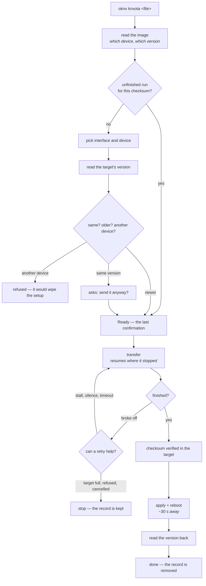

# Firmware update over the bus (knxOTA)

**For:** anyone operating a device. Flashing a device through the KNX bus — no USB, no network at
the target. Two steps that are deliberately separate: **transfer** puts the image into the target's
filesystem, **apply** makes it boot from it.

```
   transfer                                     apply
   ────────                                     ─────
   file ──KNX, ~400 B/s──▶ target's LittleFS    "boot from this"  ──▶  reboot ~2 s
   interruptible, resumable                     one command, no way back
```

## The whole run at a glance



The old firmware keeps running until the new one is complete and its checksum is good; if anything
fails, the device starts again with the old one. The two places the run can stop are the two places it
can be picked up again -- both are described below.

## What you can send

| Kind | Extension | Size, typical | Time at 400 B/s | Supported on |
|---|---|---|---|---|
| Full image | `.bin` · `.uf2` | 1.0-1.8 MB | 45-78 min | RP2040 · ESP32 |
| Full image, packed | `.gz` | 0.5-0.9 MB | 21-38 min | RP2040 (bootloader unpacks) · ESP32 (`OPENKNX_FTC_GZIP_UPDATE`) |
| Difference | `.okd` | 30-90 KB | **2-4 min** | both, with `OPENKNX_FTC_DELTA_UPDATE` |

**A difference is the normal case for an update**, a full image the case for a first install or a
recovery. Details of the format and how it is rebuilt: [DELTA.md](../reference/delta.md).

> `.okd` must stay raw — never gzip a difference. Both ends detect it by its `OKD1` magic.

## What happens in the target

**RP2040.** `picoOTA` writes a 656-byte `otacommand.bin` into LittleFS naming the staged file. The
bootloader copies (and if needed ungzips) it into the application area on the next boot. There is
always a slot.

**ESP32.** `Update.begin()/write()` writes straight into the second OTA slot and moves the `otadata`
pointer. A gzipped image is inflated on the fly through the inflater in the chip's mask ROM, so
compression costs no flash. **A single-app partition layout has no second slot** — this is checked
before writing and reported through `CheckFeatures`.

**A difference** is rebuilt in `loop()` in slices no larger than one flash sector. Nothing becomes
bootable before the rebuilt image has been checksummed, so every abort leaves the device on the
firmware it is already running.

## The three ways to do it

### Browser — the knxOTA page

`http://<device-ip>/knxota`. Pick the target PA, pick the file from this device's flash, SD or
external flash, send, apply. The device you are looking at drives the transfer; no PC is in the
chain. See [knxota-web.md](knxota-web.md).

### Device console

```
ftc 5.0.3 send firmware.bin fast    transfer
ftc 5.0.3 apply firmware.bin        apply -- target reboots
```

### PC

```bash
oknx --ip 11.11.0.126 5.0.3 send firmware.bin fast
oknx --ip 11.11.0.126 5.0.3 apply firmware.bin

oknx --ip 11.11.0.126 5.0.3 knxota firmware.bin   both in one, with checks
```

`knxota` probes reachability first, refuses an image built for the wrong chip, and asks before it
writes. `--check` runs the probes without transferring, `--force` skips the questions.

## Preparing an image

`Prepare-Firmware.ps1` (OGM-Common) offers the three kinds from a menu, with a file browser:

```
pwsh Prepare-Firmware.ps1              menu
pwsh Prepare-Firmware.ps1 -Gzip        pack a full image
pwsh Prepare-Firmware.ps1 -Delta       build a difference against an older firmware
pwsh Prepare-Firmware.ps1 -All -NoMenu unattended
```

`oknx gzip <file>` does the packing without PowerShell.

## Silence is the success case

`FwUpdate` (command 101) answers **nothing** when it worked — the device reboots instead. It answers
only when it refuses:

| Answer | Meaning | Fix |
|---|---|---|
| `0xA0` | login required | `ftc <pa> login <password>` |
| `0xA2` | writes disabled | change the access stage, or press the programming button |
| *(silence)* | applied — the device reboots in ~2 s | — |

**Known gap:** the device also stays silent when the apply fails locally — the staged file is not a
bootable image, is unreadable, or the OTA commit failed. The reason is logged in the target and, with
`OPENKNX_FTC_DELTA_UPDATE`, retrievable through `FwProbe` (command 106, [DELTA.md](../reference/delta.md)), but
the client does not ask for it yet. So a silent apply that never reboots means: look at the target's
own log.

## After the update

Read the version back and compare:

```
ftc 5.0.3 info
```

The knxOTA web page does this automatically and shows the version before and after — the only proof
that the new firmware is actually running.

## When it breaks off

An upload takes tens of minutes, so a broken-off run is not a reason to answer every question again.

**During the run**, the client offers to retry as soon as the transfer ends badly -- but only for causes
a second attempt can clear. A target that is full stays full; a run you cancelled was a decision. A
stall, a target that stopped answering, a timeout: those get the offer, and the retry continues where it
stopped rather than starting over.

**On the next start**, an unfinished run is offered again. It is recognised by the **payload checksum**,
not the file name -- a rebuilt firmware under the same name is a different image, and continuing into it
would write the remainder of something else. Everything that would be reused is shown before the
question: firmware, version, interface, target, and how far the last attempt got. A verified update
removes its record, so a finished job is never offered.

## Recovery

The target still boots the old firmware until the apply succeeded, so a failed transfer is never
fatal. If the target no longer answers on the bus:

* **RP2040** — BOOTSEL and a `.uf2` over USB.
* **ESP32** — USB flash, or ArduinoOTA over the network if that still runs.
* Both — the OpenKNX web interface accepts a firmware upload over HTTP, which is far faster than the
  bus and does not need the FTC module.

## Build switches

| Switch | Effect |
|---|---|
| `OPENKNX_FTC_DELTA_UPDATE` | differences (`.okd`), both sides; also enables the failure reporting via command 106 |
| `OPENKNX_FTC_GZIP_UPDATE` | ESP32 only — unpack a packed image into the OTA slot. RP2040 unpacks in the bootloader, the build refuses the switch there |
| `OPENKNX_FTC_KNXOTA_WEB` | the browser page ([knxota-web.md](knxota-web.md)) |

Measured flash and RAM cost of each, and every coupling the build enforces: [FLAGS.md](../reference/flags.md).
