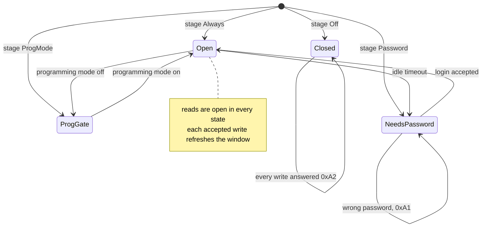

# Access protection

**For:** anyone operating a protected device; the build note at the end is for integrators. Optional,
through `-D OPENKNX_FTC_SECURITY` — without the flag the whole section disappears. Setting
`OPENKNX_FTC_CONSOLE` pulls it in unconditionally: an unauthenticated console tunnel is not a build
option ([CONCEPT-defines.md](../concept/build-defines.md)).

## What is protected

**Writes**, in stages 1–3. Reading stays open there — `ls`, `info`, `df`, download, version,
features.

Gated are: `Format` · `Rename` · `FileUpload` · `FileUploadFast` · `FileDelete` · `DirCreate` ·
`DirDelete` · `FwUpdate` — and opening the console ([CONSOLE.md](console.md)).

## The states you can meet



The desktop client resolves this **before** it sends a write, so in practice you meet its prompt rather
than a result code.

## The four stages

| Stage | writing allowed when … |
|---|---|
| `Off` | never |
| `ProgMode` | the programming button is pressed |
| `Always` | always |
| `Password` | a valid login window is open |

**Stage `Off` is the exception to "writes only":** on a configured device it locks the *whole* file
transfer, reads included. Only `CheckFeatures` (102) still answers, so a client can discover that the
device is locked rather than time out. Every other command gets `0xA2`.

The stage is **read again for every command**, not cached at start — a device just programmed behaves
by its new setting at once. An unconfigured device behaves like `Always`, so a freshly flashed device
stays reachable.

## The login

```
   Client                                        Device
     │  103  AuthChallenge                         │
     │ ───────────────────────────────────────────▶│  create a random nonce
     │◀─────────────────────────────────────────── │  nonce
     │                                             │
     │  pad the password to 16 bytes               │
     │  = AES key                                  │
     │  compute the MAC over the nonce             │
     │                                             │
     │  104  AuthResponse   [MAC]                  │
     │ ───────────────────────────────────────────▶│  compute the same MAC, compare
     │◀─────────────────────────────────────────── │  ok  ->  window open
```

**The password never travels** — only the nonce and a 4-byte MAC. The derived key is overwritten in
memory on every exit.

## The window

A **global** window, not bound to a PA. Every accepted write refreshes it; idling closes it, and
`AuthLogout` (105) closes it at once.

Practical consequence: a **running** transfer keeps itself open, a **waiting** job does not. Anyone
working through a queue logs in before each job instead of failing on an `0xA0` that looks like an
error to the user.

## Asked before, not after

The desktop client resolves the target's access state **before** it sends a write, and its verb list
mirrors the server's own gate (`secIsWriteCommand`): `send`, `perf`, `apply`, `rm`, `mv`, `mkdir`,
`rmdir`, `format`, `fwupdate`. Reads stay open and are never gated.

If the target wants a password, the client asks for it -- the same prompt the console has always used,
including the reminder that this is the ETS "access protection" parameter and not an ETS password or a
KNX Secure key. Under `-q` there is nobody to ask, so it prints `please login first` on stderr and exits
`3` without sending anything.

The point is the wasted half hour: a firmware upload that runs into a closed window fails at the first
write, after the setup, the version read and the confirmation. One round trip up front replaces that.

## Result codes

| Code | means | what the client should do |
|---|---|---|
| `0xA0` | login required | run 103/104, then retry |
| `0xA1` | login failed | wrong password, an expired or missing challenge, an empty password |
| `0xA2` | writes disabled | stage `Off`, or `ProgMode` without the button — **no** login helps |

The full code list: [ERRORCODES.md](error-codes.md).

The difference between `0xA0` and `0xA2` is the difference between "log in" and "go to the device".
Showing both as "access denied" sends the user the wrong way.

Repeated `0xA1` slow the attempt down — without blocking, and without loading the bus.

## What the hot path does not do

**Nothing per block.** The check sits at the command entry, not in the transfer loop. A login costs
two frames; the 1.8 MB transfer after it costs not one extra.
