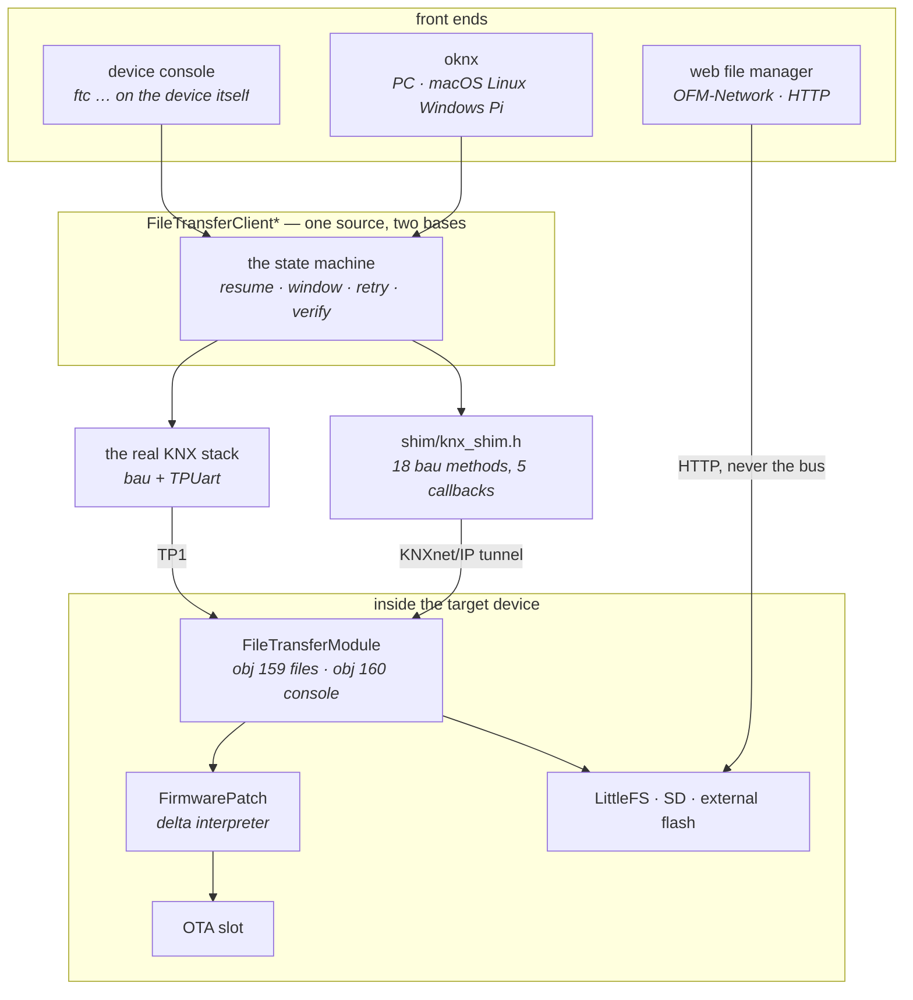

# Architecture

**For:** developers integrating, extending or debugging the module. How the pieces fit and why the
transport looks the way it does. The command surface itself is in [PROTOCOL.md](protocol.md).

## The pieces



Two things this picture is meant to settle. **The client is not written twice** -- `FileTransferClient*`
is compiled unchanged for the device and for the PC; only what it stands on differs, and that base is a
contract, not a port ([host-shim.md](host-shim.md)). And **the web file manager never touches the bus**;
it writes through the same drives over HTTP, which is why it is fast and why that speed cannot be
carried over ([../guide/throughput.md](../guide/throughput.md)).

## The path of a file

```
   PC                               KNXnet/IP                    TP1 bus            Device
  ────                             ───────────                  ─────────          ────────

  oknx                                                                         FileTransferModule
   │                                                                                    │
   │  FileTransferClient  ──┐                                                           │
   │  (the same source                                                                  │
   │   as in the device)    │                                                           │
   │                        ▼                                                           │
   │              ┌──────────────────┐      UDP 3671      ┌───────────┐   ~400 B/s      │
   └─────────────▶│  KnxIpTunnel     │───────────────────▶│ Interface │────────────────▶│
                  │  (oknx/shim)     │◀───────────────────│           │◀────────────────│
                  └──────────────────┘                    └───────────┘                 │
                                                                                        ▼
                                                            LittleFS  ·  SD  ·  ExtFlash
```

The tunnel carries **every** PA on the bus — one interface is enough to reach any device. What limits
the pace is not the tunnel but the TP1 line behind it and the device at the end
([THROUGHPUT.md](../guide/throughput.md)).

## The transport is a call, not a stream

Every operation is **one** `A_FunctionProperty_Command` on an interface object:

```
   APCI 0x2C7   ┌──────┬──────┬───────────────────────────────┐
   command      │ 159  │ PID  │ payload              <= 247 B │
                └──────┴──────┴───────────────────────────────┘
                 object  command

   APCI 0x2C9   ┌──────┬──────┬──────┬────────────────────────┐
   answer       │ 159  │ PID  │ code │ payload                │
                └──────┴──────┴──────┴────────────────────────┘
```

Two objects, two separate worlds:

| Object | for | session |
|---|---|---|
| **159** | files, directories, firmware, access protection ([PROTOCOL.md](protocol.md)) | none — every command stands alone |
| **160** | the console ([CONSOLE.md](../guide/console.md)) | one, with OPEN and CLOSE |

## One client, one state machine

`FileTransferClient` is a **singleton**: `ftcOnResponse` is static and forwards to `instance()`. One
per process, and it can do exactly **one** thing — send **or** list a directory **or** delete.

That is not an oversight, it matches the other end: there stands **one** device with **one** open file
(`_file`), and two concurrent streams run it over. Whoever needs concurrency starts a second process,
not a second client.

## What runs in the device, and when

```
  KNX dispatch (close to the interrupt)   loop()  (cooperative, under freeLoopTime)
  ─────────────────────────────────────   ────────────────────────────────────────
  processFunctionProperty()               conLoop()         run a console line
    ├─ recognise the command              crcSlice()        one slice of a checksum
    ├─ one file operation                 deltaSlice()      one slice of a firmware rebuild
    └─ return the answer                  drainOut()        emit the log ring
       -- nothing long here --
```

**Nothing long in the dispatch.** A checksum over 500 KB would stall the KNX stack and reboot the
device. That is why `FileInfo` answers "still computing" the first time and the checksum runs across
many `loop()` passes ([PROTOCOL.md](protocol.md)).

## Drives

A prefix in the path selects the target, the same way everywhere:

| Path | drive | checksum |
|---|---|---|
| `/file.bin` | LittleFS (internal) | always, computed cooperatively |
| `sd/file.bin` | SD card | on request only |
| `efc/file.bin` | external flash | on request only |

Routing happens in exactly one place (`ftmDrive`), and **a rename never crosses a drive boundary** —
moving between drives is a copy plus a delete.

## The same client on both sides

```
  Device                                   PC
  ──────                                   ──
  FileTransferClient.cpp   ◀── identical ──▶   FileTransferClient.cpp
  knx.bau()                                    oknx/shim/     →  KnxIpTunnel
  serial console `ftc …`                       argv  →  the same command parser
```

The PC client carries **no** protocol logic of its own. It only provides a base (`shim/`) that maps
`knx.bau()` onto a KNXnet/IP tunnel. What works on the device therefore works on the PC — and a
protocol bug shows on both sides instead of hiding between two implementations.

Built for eight targets; the list and the build itself are in [oknx.md](../guide/oknx.md).
